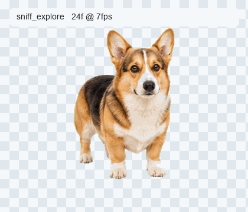
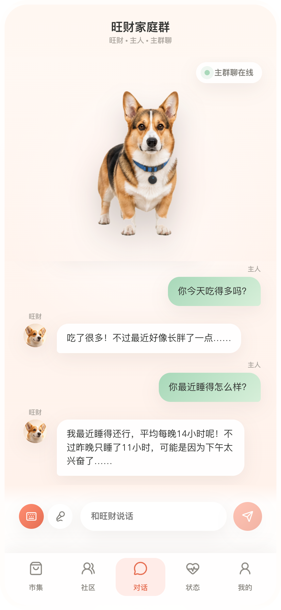
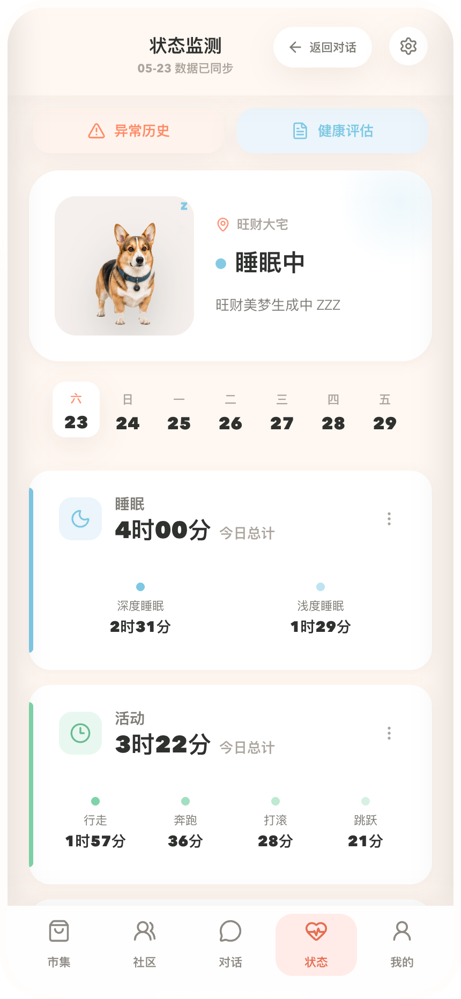
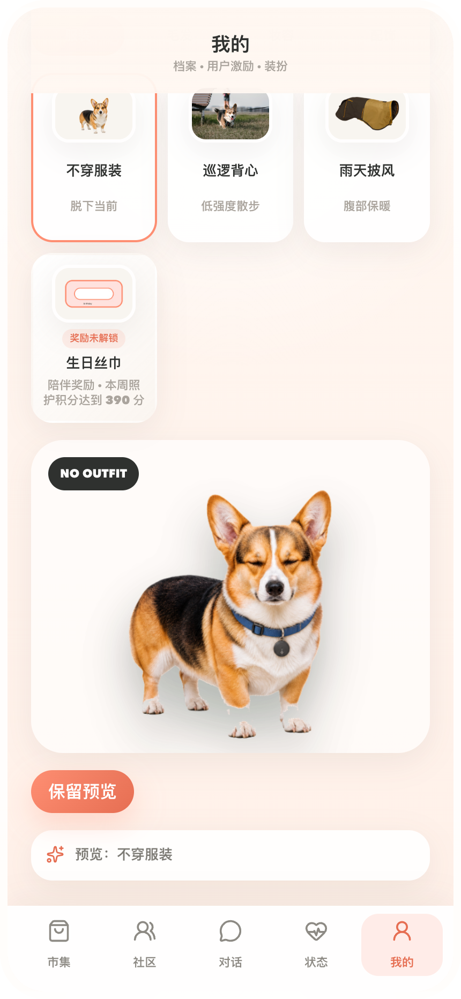
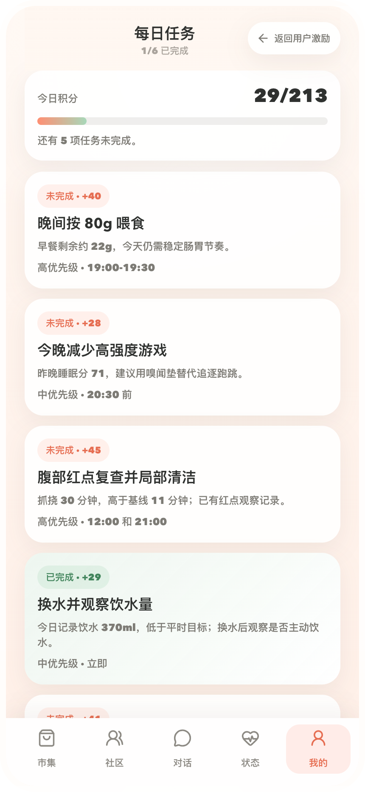
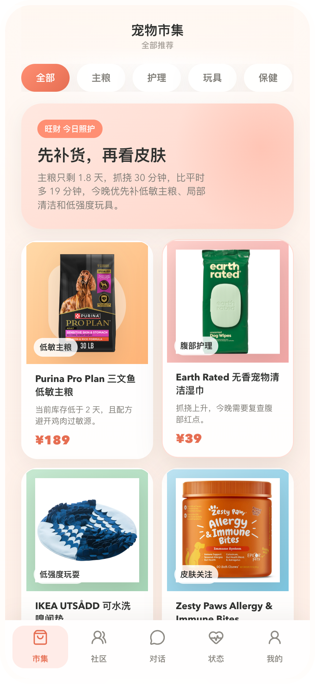
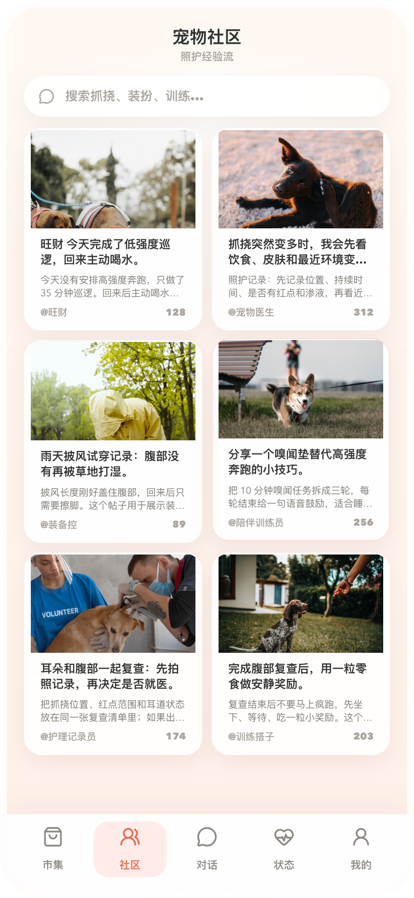

# AI Pet System

AI Pet is a macOS Electron desktop-pet demo. The product is not a standalone web page: the entry is a floating system-level pet, and clicking the pet opens a phone-ratio app window for chat, health/status, tasks, outfit, market, and community flows.

The current demo name in the product UI is `毛球伙伴`. The default pet profile is `旺财`, backed by photo-level Mochi motion assets and an app window that shares state with the desktop pet.

## Preview

<p align="center">
  
</p>

| Chat | Status | Outfit |
|---|---|---|
|  |  |  |

| Daily Tasks | Market | Community |
|---|---|---|
|  |  |  |

More product handoff images live in [`reports/product-handoff-assets-2026-05-31/`](reports/product-handoff-assets-2026-05-31/). Historical validation screenshots and research reports live under [`reports/`](reports/).

## What This Repo Contains

- One runnable app: [`ai-pet/`](ai-pet/).
- A floating Electron desktop pet entry: [`ai-pet/desktop/photo-pet/`](ai-pet/desktop/photo-pet/).
- A React/Vite renderer loaded inside the Electron app window: [`ai-pet/src/app/`](ai-pet/src/app/).
- An Express API, OpenCode/opencode agent bridge, MCP tools, voice bridge, local stores, and desktop-pet sync endpoints: [`ai-pet/server/`](ai-pet/server/).
- Product, architecture, module, plan, and fix-record knowledge base: [`ai-pet/docs/`](ai-pet/docs/).

There is no separate legacy MVP web app to maintain. Browser `localhost` pages are renderer smoke tests only; final validation must use the desktop app chain.

## Quick Start

```bash
cd ai-pet
npm install
npm run dev
```

`npm run dev` starts the full development chain:

1. Express API on `127.0.0.1:8788`.
2. Vite renderer on `127.0.0.1:5180`.
3. Electron desktop pet from `desktop/photo-pet/main.cjs`.

Use the floating desktop pet as the product entry. Clicking it opens or focuses the app window; closing the app window restores the desktop pet.

## Common Commands

Run these from [`ai-pet/`](ai-pet/).

| Command | Purpose |
|---|---|
| `npm run dev` | Start API, Vite renderer, and desktop pet Electron process. |
| `npm run dev:photo-pet` | Start only the desktop-pet Electron entry. Usually used with API/renderer already running. |
| `npm run dev:app` | Start the standalone app-window debug shell. This does not validate desktop-pet linkage. |
| `npm run typecheck` | Run TypeScript project checks. |
| `npm run build` | Typecheck, build renderer, prune dist assets, and bundle the server. |
| `npm run dist:mac` | Build an unsigned macOS zip without local env secrets. |
| `npm run dist:mac:demo` | Build a trusted local demo zip that intentionally bundles local demo env. |
| `npm run package:source` | Create a clean source handoff zip under `exports/source/`. |

## Directory Layout

| Path | Purpose |
|---|---|
| [`ai-pet/`](ai-pet/) | The only app project. Install, run, build, and package from here. |
| [`ai-pet/desktop/photo-pet/`](ai-pet/desktop/photo-pet/) | Main Electron desktop entry: floating pet, click-to-open app window, and pet/app visibility linkage. |
| [`ai-pet/desktop/app-window/`](ai-pet/desktop/app-window/) | Standalone app-window debug shell. Not a full product validation target. |
| [`ai-pet/src/app/`](ai-pet/src/app/) | Current app-window React renderer. |
| [`ai-pet/src/components/`](ai-pet/src/components/) | Components used by the current renderer. |
| [`ai-pet/src/domain/`](ai-pet/src/domain/) | Shared pet profile, state, task, motion, mock data, and domain rules. |
| [`ai-pet/server/`](ai-pet/server/) | API, agent runtime bridge, MCP tools, desktop-pet motion/appearance state, voice, and local stores. |
| [`ai-pet/public/assets/`](ai-pet/public/assets/) | Runtime assets, including Mochi motion frames and app images. |
| [`ai-pet/scripts/`](ai-pet/scripts/) | Asset, motion-pack, release, and source-package scripts. |
| [`ai-pet/docs/`](ai-pet/docs/) | Product, architecture, module, plan, and fix-record knowledge base. |
| [`docs/`](docs/) | Root-level meeting notes and cross-session index. |
| [`reports/`](reports/) | Verification screenshots, product handoff images, GIFs, and research/report artifacts. |

## Architecture Notes

The current app chain is:

```text
desktop/photo-pet Electron process
  -> transparent floating pet window
  -> phone-ratio app BrowserWindow
  -> React/Vite renderer
  -> Express API
  -> OpenCode/opencode runtime + AI Pet MCP tools
  -> shared domain state, local stores, motion assets, voice, and appearance sync
```

The authoritative architecture docs are:

- [`ai-pet/docs/architecture/current-system-architecture-2026-05-30.md`](ai-pet/docs/architecture/current-system-architecture-2026-05-30.md)
- [`ai-pet/docs/architecture/technical-architecture-2026-05-30.md`](ai-pet/docs/architecture/technical-architecture-2026-05-30.md)
- [`ai-pet/docs/product/product-spec-2026-05-30.md`](ai-pet/docs/product/product-spec-2026-05-30.md)
- [`ai-pet/docs/modules/INDEX.md`](ai-pet/docs/modules/INDEX.md)

## Validation Rule

For desktop-pet behavior, app-window launch, pet visibility, motion sync, outfit sync, or agent-triggered motion, do not treat `http://127.0.0.1:5180/` as the final app. It is only a renderer debug URL. The acceptance target is the Electron chain started by `npm run dev` or a packaged `AI Pet Demo.app`.
