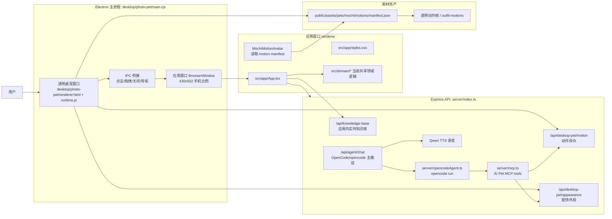

# AI Pet 当前系统架构总览

## 文档定位

本文是当前 AI Pet 可运行 Demo 的整体架构真相源。后续进入项目时，应该先读 `../INDEX.md`，再读本文、产品规格和模块索引。

修复记录只记录历史问题和证据；开发计划只记录执行路径。当前系统到底怎么运行、哪些目录负责什么、哪些入口能验收，以本文和 `technical-architecture-2026-05-30.md` 为准。

产品整体构想、分层框架、长期对话记忆、主动沟通和狗狗语气的入口见 [AI Pet 产品逻辑与分层框架](product-logic-framework-2026-05-31.md)。本文只记录当前可运行系统的实现拓扑和验收边界。

## 一句话架构

AI Pet 当前不是 HTML 展示页，也不是单独的网页前端项目。当前可运行系统是：

`desktop/photo-pet` Electron 桌宠集成进程 + Electron 应用窗口 + React/Vite renderer + Express API + OpenCode/opencode Agent runtime + AI Pet MCP tools + 共享 Domain + Mochi 照片级动作资产。

React、Vite、HTML、CSS 是 Electron `BrowserWindow` 里的 renderer 技术，不是产品交付形态。产品交付形态是桌面 App 链路：系统级桌宠常驻桌面，用户点击桌宠后弹出应用窗口。

## 当前运行拓扑

## 运行入口

| 命令 | 启动内容 | 当前用途 | 是否可作为完整验收 |
|---|---|---|---|
| `npm run dev` | API + Vite renderer + `desktop/photo-pet` | 当前完整 Demo 默认入口 | 是 |
| `npm run dev:photo-pet` | `desktop/photo-pet/main.cjs` | 桌宠集成入口单独调试，通常需要 API/renderer 已运行 | 可验桌宠链路 |
| `npm run dev:desktop` | `desktop/photo-pet/main.cjs` | 当前小狗桌宠入口别名，避免误启动旧像素宠物 | 可验桌宠链路 |
| `npm run dev:app` | `desktop/app-window/main.cjs` | standalone 应用窗口 UI 调试 | 否 |
| `npm run dev:renderer` | Vite `127.0.0.1:5180` | renderer smoke test | 否 |
| `npm run mcp:ai-pet` | `server/mcp.ts` | AI Pet MCP tools 本地服务 | 工具层验证 |
| `npm run agent:opencode:test` | `opencode run --agent ai-pet-companion ...` | OpenCode/opencode Agent 路径测试 | Agent 层验证 |

完整验收必须从 `npm run dev` 或等价的 `desktop/photo-pet` 集成链路开始。浏览器 `localhost` 只能说明 renderer 可渲染，不能证明桌面 App、桌宠点击、窗口显隐或桌宠同步成立。

`desktop` 命名在当前项目中只能指照片级小狗桌宠。OpenPets 旧像素宠物的运行脚本和 API 桥接已删除，避免用户或试用者误把橙色 built-in pet 当成当前 Demo。

## App 验收红线

当用户说“App 不能用”“桌宠 App 呢”“不是 HTML”或任何涉及真实产品可用性的反馈时，执行和回复都必须以桌面 App 链路为目标：

- 先检查或启动 `npm run dev`，确保 API、Vite renderer 和 `desktop/photo-pet` Electron 进程同时存在。
- 如果验证的是交付态 App，应该直接启动 `release/mac-arm64/AI Pet Demo.app` 或解压后的 `.app`；打包 App 会加载内置 `dist/index.html` 并启动 bundled API，不依赖 `127.0.0.1:5180`。
- 最终验证必须在 `desktop/photo-pet` 创建的桌宠窗口和应用窗口中完成；可以使用 Computer Use 查看和操作本机 Electron 窗口。
- `http://127.0.0.1:5180/` 只允许作为 renderer smoke test。它打不开时，只能说明 Vite renderer dev server 未运行，不能把该浏览器页面称为 App，也不能把它作为交付入口。
- `desktop/app-window/main.cjs` 只用于 standalone 应用窗口调试；它没有桌宠窗口和显隐联动，不能替代完整桌面 App 验收。
- 如果验证截图来自浏览器，必须明确标注为 renderer smoke test；最终结论必须另有 Electron 桌宠/应用窗口截图或实际操作记录支撑。

## 进程与窗口边界

### `desktop/photo-pet` 集成进程

`desktop/photo-pet/main.cjs` 是当前完整 Demo 的桌面入口。它负责：

- 创建透明、置顶、跳过任务栏的桌宠窗口。
- 加载 `desktop/photo-pet/renderer.html` 和 `runtime.js` 播放 Mochi 照片级动作帧。
- 处理桌宠拖拽。
- 处理桌宠点击，并创建或聚焦应用窗口。
- 应用窗口打开或聚焦时隐藏桌宠窗口。
- 应用窗口关闭时恢复桌宠窗口。

`desktop/photo-pet/runtime.js` 是桌宠 renderer。它负责：

- 读取 `public/assets/pets/mochi/motions/manifest.json`。
- 播放完整多帧动作序列。
- 轮询动作命令和外观配饰状态。
- 按配饰状态切换完整帧图，不把服装、毛发、妆容伪装成已真实同步到桌宠。

### 应用窗口

应用窗口是桌宠点击后弹出的产品功能面板。当前窗口接近手机比例，约 `430x932`。

应用窗口负责：

- 欢迎页和开始陪伴入口。
- 陪伴对话主页。
- 状态与数据、异常报告和健康解释。
- 市集、社区、状态和我的五个主入口。
- “我的”页内保留宠物资料、宠物知识库、用户激励入口和装扮功能；用户激励再进入每日任务、排行榜和奖励/可解锁服饰详情页。
- 将关键结果同步回桌宠，例如配饰外观、动作命令、提醒和状态。

应用窗口可以由 `desktop/photo-pet/main.cjs` 创建，也可以由 `desktop/app-window/main.cjs` 单独调试。只有前者能验证完整桌宠联动。

### Renderer

`src/app/App.tsx`、`src/app/styles.css`、`index.html` 和 Vite dev server 是应用窗口 renderer。它们不是静态网页交付物。

renderer 负责：

- 呈现应用窗口 UI。
- 收集用户输入和点击。
- 调用 API。
- 读取当前共享的 `src/domain/*` 数据结构。
- 在应用窗口中复用 Mochi motion manifest 做视觉一致的宠物预览。

renderer 不应该直接拥有业务真相。后续 Domain Service 成熟后，renderer 应只做呈现和交互。

### `desktop/app-window`

`desktop/app-window/main.cjs` 只创建 standalone 应用窗口。它保留用于应用窗口 UI 调试和快速复查，不创建桌宠窗口，不控制桌宠显隐，也不能作为完整产品验收入口。

## 代码目录职责

| 路径 | 架构职责 |
|---|---|
| `desktop/photo-pet/` | 当前完整桌宠集成入口、透明桌宠窗口、桌宠 renderer、点击打开应用窗口、显隐联动 |
| `desktop/app-window/` | standalone 应用窗口调试入口 |
| `src/app/App.tsx` | 应用窗口主 renderer，承载五个主入口和交互流程 |
| `src/app/styles.css` | 应用窗口视觉样式 |
| `src/domain/` | 当前共享领域模型、mock 数据、状态、动作、档案和推荐规则；后续要抽到端无关 Domain Service |
| `src/components/` | 当前 App 实际使用的共享组件；过时 MVP 组件不保留 |
| `server/` | Express API、OpenCode/opencode Agent 主路径、AI Pet MCP tools、OpenAI Agents SDK fallback、语音、动作命令和外观状态 |
| `server/appearance.ts` | 宠物外观单一真相源，保存和读取当前真实同步配饰状态；Demo 阶段持久化到 `.ai-pet-data/appearance.json` |
| `server/threadStore.ts` | Demo 阶段的主群聊消息和长期记忆持久化 store；默认写入 `.ai-pet-data/thread-store.json` |
| `server/knowledgeBase.ts` | Demo 阶段的应用内知识库 store；默认写入 `.ai-pet-data/knowledge-base.json`，并通过 SSE 推送更新 |
| `opencode.json` | OpenCode/opencode 配置，声明 llmmelon provider、`ai-pet-companion` agent 和 `ai_pet` MCP server |
| `.opencode/prompts/` | OpenCode/opencode Agent 提示词 |
| `public/assets/pets/mochi/` | Mochi 图片、动作 manifest、透明帧和配饰帧资产 |
| `scripts/` | 动作包和素材生成工具 |
| `dist/` | Vite 构建产物，被 Electron 加载；不是源码真相 |
| `reports/` | 验证截图、GIF、HTML 调研报告和运行证据；不是产品入口，不是架构真相源 |

## 领域与数据架构

当前核心领域对象：

- `PetProfile`：真实宠物或纯电子宠物档案，包括显示名、头像、物种、年龄、健康和外观信息。
- `PetState`：饱腹、心情、精力、清洁、亲密度、健康标记和当前动作。
- `EvidenceEvent`：设备数据、手动记录、互动事件、库存变化和异常证据。
- `DailyTask`：照护、互动、健康和推荐任务。
- `InventoryItem`：库存、剩余天数、适用宠物和约束。
- `ProductRecommendation`：商品或服务推荐及触发原因。
- `ExpressionCommand`：桌宠说话、动作、提醒和状态表达。
- `PetAppearanceState`：宠物当前真实外观状态。当前只包含可同步到照片级桌宠动作帧的配饰状态，是“我的页、对话页、状态页、桌宠”共同读取的单一真相源。

当前这些对象主要位于 `src/domain/*`，同时被应用窗口和 API 使用。后续正确方向是抽成共享 Domain Service：API、Agent tools、桌宠运行时和未来移动端都调用同一套领域服务，而不是各端各写一份状态。

## 数据流

### 点击桌宠打开应用窗口

1. 用户点击透明桌宠窗口。
2. `desktop/photo-pet/runtime.js` 判断不是拖拽后，通过 preload/IPC 请求打开应用窗口。
3. `desktop/photo-pet/main.cjs` 创建或聚焦应用窗口。
4. 主进程隐藏桌宠窗口。
5. 应用窗口加载 Vite dev server 或 `dist/index.html`。
6. 用户关闭应用窗口后，主进程恢复桌宠窗口。

### 应用窗口同步桌宠外观

外观同步的架构原则是：`PetAppearanceState` 是唯一真相源，不允许“我的页预览、对话页宠物、桌面桌宠”各自维护一套外观状态。

1. 用户在“我的/装扮”中选择当前支持的配饰。
2. 应用窗口调用外观状态 API：`POST /api/desktop-pet/appearance`。
3. `server/appearance.ts` 校验配饰 ID，计算资产状态，并把当前 `PetAppearanceState` 持久化到 `.ai-pet-data/appearance.json`。
4. API 返回新的 `PetAppearanceState`；应用窗口根状态更新 `accessoryId`。
5. 欢迎页、对话页、状态页和“我的/装扮”已保存状态都用同一个 `accessoryId` 渲染 `MochiMotionAvatar`。
6. `desktop/photo-pet/runtime.js` 轮询外观状态，应用窗口关闭时还必须强制刷新一次外观状态。
7. 桌宠按配饰选择对应完整动作帧图；缺失帧可回退原始帧，但不能显示另一套状态。

当前真实桌宠换装只承诺配饰同步。服装、毛发、妆容如果出现在 UI 中，只能作为应用窗口预览或后续方案，不能写成已真实同步到桌宠。

详细模块契约见 [AI Pet 宠物外观单一真相源模块](../modules/pet-appearance-2026-05-31.md)。

### 用户激励任务与奖励解锁

1. 用户进入“我的”页，点击“用户激励”入口。
2. 应用窗口进入用户激励页，展示今日积分、本周积分、连续天数、任务完成数、当前排名和奖励进度摘要。
3. 用户点击“每日任务”，进入任务详情页；未完成任务可点击完成。
4. 完成任务后，本地领域状态更新今日积分、完成数、连续天数和当前宠物周积分。
5. 用户返回用户激励页或进入“排行榜”详情页时，排行榜中的当前宠物分数和名次必须反映最新任务完成状态。
6. 用户进入“奖励/可解锁服饰”详情页时，能看到装扮页里标注“奖励获得”的服饰或配饰的解锁来源、条件和进度。
7. 装扮页只展示和消费已解锁/未解锁状态；不负责解释奖励体系，也不因为用户激励拆成独立同级入口集合。

### Agent 触发桌宠动作

1. 用户在对话页提出动作或互动请求。
2. 对话页调用 `/api/agent/chat`。
3. `/api/agent/chat` 优先调用 OpenCode/opencode runtime。
4. OpenCode/opencode 通过 `ai_pet` MCP tools 读取宠物状态、写入记忆或请求动作。
5. 如果 OpenCode/opencode runtime 不可用，后端才回退到 OpenAI Agents SDK 或 local fallback。
6. Agent 通过 `request_pet_motion` 或等价 MCP tool 写入动作命令。
7. 桌宠运行时轮询动作命令并播放对应 motion manifest 动作。

动作仲裁优先级：

1. Agent 明确工具调用。
2. 轻交互或演示指令触发的随机动作。
3. 设备/手环/状态映射出的默认动作。

### 对话历史和主动沟通

1. 应用窗口进入对话页时请求 `GET /api/agent/threads/:threadId/messages` 读取主群聊历史。
2. 如果历史为空，前端使用 seed 消息；如果历史存在，前端把历史消息合并回当前对话页。
3. 应用窗口随后请求 `POST /api/agent/threads/:threadId/proactive`。
4. 后端基于当前状态、抓挠/红点、任务和库存判断是否需要主动提醒。
5. 需要提醒时，后端写入一条 `provider: "proactive-alert"` 的宠物消息，并返回 `remind` 动作命令。
6. 用户发送消息时，`/api/agent/chat` 会把用户消息、宠物回复、工具卡片和长期记忆写入 `threadStore`。
7. Agent 输入会合并持久化历史和当前前端历史，避免只靠本轮输入回答。

当前持久化层是本地 JSON store，不是生产数据库；它用于 Demo 阶段证明长期主群聊和记忆召回成立。正式数据层迁移时不能改变“一个宠物一个主 thread”的产品契约。

### 应用内知识库实时更新

当前应用窗口在“我的”页提供“宠物知识库”入口。该板块读取 `/api/knowledge-base`，并通过 `/api/knowledge-base/stream` 接收实时更新。

知识库更新来源包括：

1. `/api/agent/chat` 写入的用户消息、宠物回复和结构化 memory。
2. `/api/agent/threads/:threadId/proactive` 生成的主动提醒。
3. `/api/desktop-pet/appearance` 保存的桌宠配饰状态。
4. 应用窗口完成每日任务时写入的 `POST /api/knowledge-base/events`。

当前知识库 store 是可安装 Demo 的本地 JSON 持久层，不是生产后台数据库。打包态写入 macOS Application Support 目录，避免 App bundle 只读导致知识库不能更新。

## Agent 架构边界

AI 能力不能降级成普通 prompt 拼接聊天框，也不能由项目自研完整 agent loop。

当前事实：

- 主路径：OpenCode/opencode runtime + `ai_pet` MCP tools。
- 项目侧：只维护宠物业务工具、数据契约、状态机、UI 和端入口。
- 模型供应商：llmmelon OpenAI-compatible Chat Completions，默认 `claude-sonnet-4-6`；`claude-opus-4-6` 已实测可用。
- 语音供应商：阿里云百炼 Qwen Voice Design + Qwen TTS 负责语音。

OpenAI Agents SDK 路径只作为 fallback，不能描述为最终 Agent 底座。Qwen key 只用于语音，不用于聊天模型。

## 与 OpenPets 的关系

OpenPets 是早期桌宠底座调研材料，不是当前完整 Demo 的运行入口，也不再保留项目内启动脚本、API 桥接或 UI 组件。

当前默认入口是 `desktop/photo-pet`，原因是它已经承载：

- 照片级 Mochi 多帧动作。
- 透明桌面窗口。
- 点击打开应用窗口。
- 应用窗口打开/关闭时桌宠隐藏/恢复。
- 配饰外观状态轮询。

历史调研文档可以保留 OpenPets 的评估结论，但当前交付版不能再启动或控制 OpenPets built-in pet。

## 验证标准

任何涉及桌宠、应用窗口、点击、关闭、动作、外观同步或 Agent 工具调用的改动，都不能只用浏览器验证。

必须验证：

- `npm run dev` 或等价完整链路能启动。
- 桌面先出现系统级桌宠窗口。
- 点击桌宠会打开或聚焦应用窗口。
- 应用窗口打开后桌宠隐藏。
- 应用窗口关闭后桌宠恢复。
- 应用窗口 UI 改动在 Electron 窗口中可见。
- 桌宠相关动作或外观同步在桌宠窗口中可见。

允许的辅助验证：

- 浏览器 `127.0.0.1:5180`：只用于 renderer smoke test。
- `npm run dev:app`：只用于 standalone 应用窗口调试。
- `reports/`：只存截图、GIF、HTML 调研报告和验证证据。

## 禁止误读

- 禁止把 `src/app/App.tsx` 或 Vite dev server 说成产品是前端 HTML。
- 禁止把 `desktop/photo-pet/renderer.html` 说成 HTML 展示页；它是 Electron 桌宠窗口 renderer。
- 禁止用浏览器截图替代 Electron 应用窗口验收。
- 禁止把 `desktop/app-window/main.cjs` 当成完整产品入口。
- 禁止重新加入 OpenPets built-in pet 运行入口，除非先完成新的架构评审并能证明它承载的是当前照片级小狗形象。
- 禁止把 reports 下的 HTML 调研报告当成产品页面。
- 禁止把 OpenAI Agents SDK fallback 写成当前主 Agent 底座。

## 后续演进

近期架构演进应围绕三件事：

1. 把 `src/domain/*` 抽成可被 API、Agent tools、桌宠和未来端复用的 Domain Service。
2. 继续扩大 AI Pet MCP tools 覆盖面，并保持 OpenCode/opencode 主路径稳定；OpenAI Agents SDK 仅保留 fallback。
3. 保持 `desktop/photo-pet` 完整 App 链路稳定，再扩展桌宠动作、配饰同步、健康任务和商业推荐。
