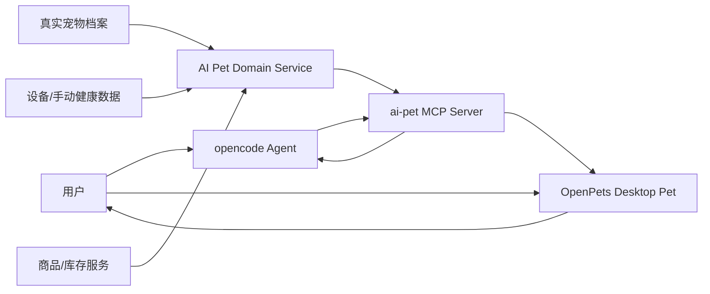

# 历史 MVP 架构

日期：2026-05-29

> 本文是早期 MVP 架构记录，已由 [AI Pet 技术架构](technical-architecture-2026-05-30.md) 接管。若本文与新技术架构、[AI Pet 当前产品规格](../product/product-spec-2026-05-30.md) 或 [MVP 功能设计对齐](../plan/mvp-feature-design-2026-05-30.md) 冲突，以新文档为准。本文中的早期“Web 控制台”表述统一按“桌宠点击后弹出的应用窗口/功能面板”理解。

本文描述真实宠物关联主线的早期 MVP 架构。2026-05-30 后已确认：AI 电子宠物陪伴和真实宠物数字分身共存；桌宠是核心入口；涉及 AI 的能力必须接成熟 agent；当前优先跑通系统级桌宠 + 点击桌宠后弹出的应用窗口。项目没有 HTML 展示页。

## 总体架构



## 模块拆分

### 1. Domain Service

职责：

- 管理真实宠物档案。
- 管理虚拟宠物状态。
- 接收健康/活动/库存数据。
- 生成每日任务。
- 给 AI 返回可解释摘要。
- 输出商品推荐候选。

建议实现：

- 第一版用本地 SQLite + TypeScript/Fastify 或 Python/FastAPI 均可。
- 如果主桌宠采用 OpenPets/Electron，TypeScript 会更顺。
- 状态机可参考 codex-pet-companion 的 Python 逻辑后迁移到 TS。

### 2. MCP Server

职责：

- 把 Domain Service 暴露成 agent tools。
- 控制 OpenPets 显示气泡、反应、移动。
- 收口权限：不要让 agent 直接操作文件系统、shell 或真实购买。

工具：

- `get_pet_profile`
- `update_pet_profile`
- `get_live_metrics`
- `record_metric`
- `record_care_event`
- `get_virtual_pet_state`
- `plan_daily_tasks`
- `get_inventory`
- `record_inventory`
- `recommend_products`
- `virtual_pet_say`
- `virtual_pet_react`
- `virtual_pet_move`

### 3. Agent Runtime

第一版：opencode。

职责：

- 负责自然语言理解、调用 MCP tools、组织回复。
- 不直接管理宠物业务状态。
- 不直接执行高风险购买/医疗动作。

### 4. Desktop Pet Runtime

第一版：OpenPets。

职责：

- 显示宠物形象。
- 显示 AI 气泡和任务提醒。
- 表达状态：开心、疲惫、饥饿、需要清洁、提醒、警告。
- 支持 pet pack 切换。

### 5. Health Adapter

第一版：

- manual input
- mock wearable
- CSV/JSON import

第二阶段：

- FitBark adapter
- PetPace/Tractive 合作或 API 验证

### 6. Commerce Adapter

第一版：

- 本地商品 mock catalog。
- 推荐时输出原因、约束、替代项。

第二阶段：

- 接宠物电商 API。
- 做价格、库存、配送和 affiliate 追踪。

## 数据模型草案

### PetProfile

```json
{
  "id": "pet_001",
  "name": "Mochi",
  "species": "dog",
  "breed": "Corgi",
  "ageMonths": 28,
  "weightKg": 12.4,
  "bodyConditionScore": 5,
  "sex": "female",
  "neutered": true,
  "allergies": ["chicken"],
  "conditions": ["sensitive_stomach"],
  "diet": {
    "currentFood": "salmon kibble",
    "dailyGrams": 160
  },
  "appearance": {
    "coatColor": "sable-white",
    "earShape": "upright",
    "tail": "short"
  }
}
```

### VirtualPetState

```json
{
  "petId": "pet_001",
  "avatarPackId": "mochi-corgi-sprite-v1",
  "fullness": 72,
  "mood": 81,
  "energy": 58,
  "cleanliness": 64,
  "friendship": 42,
  "healthFlags": ["low_activity_today"],
  "currentAnimation": "idle",
  "lastUpdatedAt": "2026-05-29T10:00:00+08:00"
}
```

### DailyTask

```json
{
  "id": "task_walk_morning",
  "petId": "pet_001",
  "type": "walk",
  "title": "上午遛狗 20 分钟",
  "reason": "过去 24 小时活动量低于平时均值 35%",
  "priority": "high",
  "requiresInventory": false,
  "riskLevel": "normal",
  "status": "pending"
}
```

## 第一版产品流

1. 用户录入真实宠物档案。
2. 系统选择或生成宠物 pack。
3. OpenPets 显示虚拟宠物。
4. opencode 通过 MCP 读取档案和状态。
5. AI 生成今日任务，并让桌宠说出提醒。
6. 用户完成喂食/遛狗/清洁后记录事件。
7. 状态机更新虚拟宠物状态。
8. 库存不足时给出商品推荐。

## 架构裁决

- 不做全自研桌宠 runtime。
- 不做全自研 agent runtime。
- 不让 agent 直接下单或做医疗诊断。
- 所有业务事实进入 Domain Service，agent 只通过工具访问。
