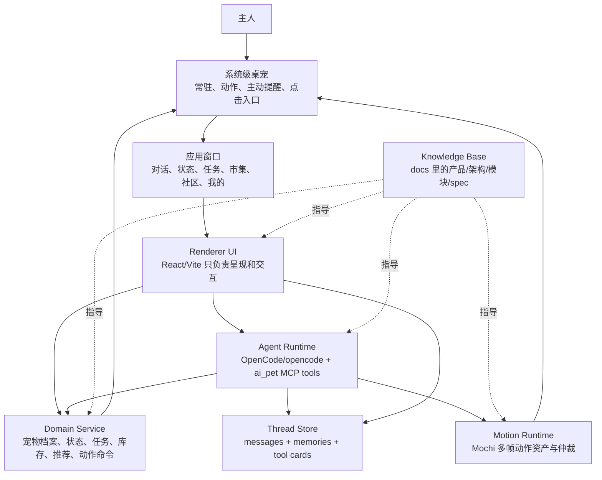

# AI Pet 产品逻辑与分层框架

## 文档定位

本文是 AI Pet 的“整体构想和项目逻辑”入口。进入项目后，不应该每次先靠读 `src/app/App.tsx`、`server/agent.ts` 或 Electron main 进程来反推产品形态；应先读 `../INDEX.md`，再读本文、当前系统架构、产品规格和模块索引。

修复记录只放历史问题；模块 spec 写具体模块契约；本文负责把用户构想、产品闭环、层级职责和数据流串起来。

## 用户构想

当前用户要求的核心产品不是普通聊天 App，也不是一张 HTML 展示页，而是一个有真实桌面存在感的 AI 宠物：

- 桌宠常驻桌面，是产品第一入口。
- 点击桌宠后打开应用窗口，复杂功能在应用窗口完成。
- 应用窗口顶部的宠物形象和桌面宠物是同一只宠物，动作、状态、装扮和 Agent 指令要同步。
- 关闭应用窗口后，桌宠必须重新回到桌面，不能因为应用窗口打开/关闭状态丢失桌宠存在感。
- 对话页是这只宠物的长期家庭群聊，不是每次新建的临时问答。
- 宠物必须有长期对话记忆，能记住主人说过的习惯、承诺、照护安排和关系信息。
- 宠物必须能主动沟通；进入对话页时，如果状态、任务、库存或异常提示有问题，宠物应主动开口。
- 对话页主动消息和桌宠气泡必须来自同一条宠物事件；不能应用窗口生成一句、桌宠再独立生成另一句。
- 当前宠物是狗狗，语气要像狗狗本人和主人说话，而不是客服、诊断机器人或普通 AI 助手。

## 一句话产品闭环

AI Pet 用系统级桌宠承载陪伴存在感，用应用窗口承载完整功能，用 Agent 把对话、记忆、状态、照护任务、商品推荐和桌宠动作串成同一只宠物的连续体验。

## 用户激励信息架构

用户激励是当前 Demo 的 P0 闭环，不是泛社区 P2 功能，也不是“我的”页中的静态说明区。

正确结构是：

```text
我的
├─ 宠物档案 / 知识库 / 我的装扮区
└─ 用户激励入口
   └─ 用户激励页
      ├─ 每日任务详情页
      ├─ 排行榜详情页
      └─ 奖励 / 可解锁服饰页
```

设计边界：

- “我的”页保持个人、宠物档案、知识库和装扮承载页的身份，只放一个“用户激励”入口。
- 不把“我的”页改成入口集合；尤其不能因为新增用户激励，把装扮拆成同级入口卡片。
- 用户激励页独立展示积分、连续天数、任务完成数、排名和奖励进度摘要。
- 每日任务详情页必须展示每个任务的具体内容、完成/未完成状态、原因、时间窗口和积分。
- 排行榜详情页必须可点击排名条目，并高亮当前宠物。
- 奖励/可解锁服饰页必须解释“奖励获得”服饰或配饰的来源、条件和进度；装扮页只消费解锁结果。

如果后续 UI 或代码和这套结构冲突，应先修 UI/代码，不能再把错误实现回写成文档真相。

## 分层框架



## 层级职责

| 层 | 职责 | 当前代码入口 |
|---|---|---|
| 桌宠层 | 常驻桌面、响应点击、播放动作、接收主动提醒和 Agent 动作命令 | `desktop/photo-pet/`, `public/assets/pets/mochi/motions/manifest.json` |
| 应用窗口层 | 点击桌宠后弹出，承载五个主入口和对话页面 | `desktop/photo-pet/main.cjs`, `desktop/app-window/main.cjs` |
| Renderer UI 层 | 渲染页面、收集输入、展示消息/工具卡片/动作状态 | `src/app/App.tsx`, `src/app/styles.css` |
| Domain 层 | 宠物档案、状态、任务、库存、推荐和动作数据结构 | `src/domain/*`, `server/petRuntimeSnapshot.ts` |
| Agent 层 | 生成宠物回复、调用工具、写记忆、触发桌宠动作 | `server/agent.ts`, `server/opencodeAgent.ts`, `server/mcp.ts`, `.opencode/prompts/` |
| 持久层 | 保存长期主群聊消息和结构化记忆 | `server/threadStore.ts`, `.ai-pet-data/thread-store.json` |
| 知识库层 | 保存产品真相、架构真相、模块边界、修复记录和验证标准 | `docs/`, `ai-pet/docs/` |

## 对话页主逻辑

对话页是单宠物唯一主群聊：

1. 根据 `PetProfile` 计算 `mainThreadId`，当前 Demo 形如 `pet_mochi_main`。
2. 进入对话页时，前端先请求 `GET /api/agent/threads/:threadId/messages`。
3. 若已有持久化消息，则合并 seed 消息和持久化消息；若没有历史，才显示初始 seed。
4. 进入对话页后，前端请求 `POST /api/agent/threads/:threadId/proactive`。
5. 后端基于当前宠物状态、手动观察、任务和库存判断是否需要主动开口。
6. 如果有问题，后端写入一条 `proactive-alert` 宠物消息，并返回 `request_pet_motion` 风格的提醒动作命令。
7. 用户发送消息时，前端把当前历史和输入发给 `/api/agent/chat`。
8. 后端合并持久化历史和本轮前端历史，把最近群聊记录和长期记忆一起交给 Agent。
9. 后端保存用户消息、宠物消息、工具卡片和 memory。
10. 桌宠运行时轮询动作命令，播放对应动作。

## Agent Runtime 与 Dog Persona

Agent Runtime 和 Dog Persona 不是同一个概念。

- Agent Runtime 是不可见的宠物大脑，负责接用户输入、timer tick、domain hook、工具结果和长期记忆。
- Dog Persona 是用户可见的狗狗表达层，负责把后台事实转成狗狗伙伴自己的感受、动作和请求。
- 后台可以判断“抓挠 30 分钟、早餐 138g、晚间照护任务”，但狗狗不能像管理员一样说“今天我会盯住三个重点”。
- 可见输出应该像狗狗本人，例如“主人，我肚皮有点痒，想让你帮我摸摸看看。”

更完整的 runtime、timer、hook 和气泡生命周期定义见 [AI Pet Agent Runtime、Dog Persona 与桌宠气泡生命周期](agent-runtime-dog-persona-and-bubble-lifecycle-2026-05-31.md)。

## 同源宠物事件

对话页、桌宠气泡和左右分屏展示都必须复用同一条宠物事件，而不是各端分别生成文案。

当前事件源约定：

- `ThreadMessage` 是用户可见文本的主源。
- `ExpressionCommand` 只负责桌宠动作和唤醒，不重新生成气泡内容。
- `ExpressionCommand.context.messageId` 指向对应 `ThreadMessage.id`。
- `ExpressionCommand.context.bubbleText` 缓存同一条消息文本，供桌宠 motion 轮询时即时显示。
- 桌宠恢复或变为可见时，通过后端读取最新宠物消息作为气泡，不能另起一套 prompt。
- 桌宠动作循环可以继续切换动作，但不能把共享对话气泡覆盖成 motion manifest 的动作说明。
- 桌宠界面只保留一个上方 speech bubble；底部动作调试标签不属于用户界面。
- 桌宠气泡只是新消息的短时展示，每个 `ThreadMessage.id` 最多展示一次，当前 Demo 展示 8 秒后隐藏。

窗口生命周期约定：

1. 桌宠打开应用窗口时，桌宠可以隐藏，避免和应用窗口重叠。
2. 应用窗口关闭、隐藏或销毁时，Electron 主进程必须恢复桌宠。
3. 桌宠恢复后立即拉取最新同源宠物事件；如果该消息尚未展示过，则显示 8 秒；如果已经展示过，不重复播报。
4. 如果没有最新 thread 消息，桌宠才退回 motion manifest 自带的默认短文案。

## 左右分屏展示框架

“UI 录屏 + 实拍/AI 生成”左右分屏展示不是独立数据源，而是主 thread/event 时间线的演示形态。

左侧展示产品对话界面，消息逐步出现：

- 小狗：“今天阳光很好，我在窗边睡了一下午呢~”
- 小狗：“下午有只小鸟停在阳台上，我盯着它看了好久！”
- 小狗：“不过它飞走了，我又睡了一觉~”
- 用户：“你今天吃得多吗？”
- 小狗：“吃了很多！不过最近好像长胖了一点……”

右侧根据同一条事件时间线播放素材：

- `sun-window-nap`：小狗趴在窗边晒太阳。
- `bird-balcony-watch`：小狗抬头看阳台上的小鸟。
- `mat-nap`：小狗蜷在垫子上打盹。
- `door-greeting`：听到主人回家兴奋地跑向门口。

实现时应先把这些片段建模成事件或 storyboard item，再由左侧对话、右侧视频/图像和桌宠气泡共同引用，避免展示视频和产品实际行为两套逻辑。

## 长期记忆设计

长期记忆分两层：

- `messages`：完整群聊流水，包括用户消息、宠物消息、主动提醒、工具卡片元信息。
- `memories`：结构化长期记忆，包括主人偏好、照护安排、宠物习惯、事件摘要和 thread summary。

当前 Demo 的持久化实现是本地 JSON store：

- 默认路径：`.ai-pet-data/thread-store.json`。
- 可通过 `AI_PET_THREAD_STORE_FILE` 指向测试文件。
- 当前不是正式生产数据库；它是 Demo 阶段的最小持久层，用来证明长期主群聊、主动提醒和记忆召回逻辑成立。

生产方向应迁移到 SQLite、PostgreSQL 或应用内正式数据库，但 API 契约不应再退回前端 state。

## 主动沟通设计

主动沟通不是随机欢迎语。进入对话页时，宠物应根据真实上下文判断是否需要主动说话。

当前优先级：

1. 抓挠、腹部红点、皮肤观察或手动异常记录。
2. 健康指数偏低。
3. 进食量低于计划。
4. 高优先级待办任务。

主动消息必须满足：

- 以宠物本人发言，不说“系统检测到”。
- 有狗狗身体感和依恋感，例如“肚皮有点痒”“想先被摸摸确认一下”。
- 能同步桌宠动作，当前默认触发 `remind`。
- 写入同一个 thread，下一次进入仍可看到。

当前 Demo 已实现的主动来源：

- 进入对话页的主动提醒：`POST /api/agent/threads/:threadId/proactive`。
- Agent Cron：`server/petEventRuntime.ts` 默认每 60 秒触发 `cron.companion_checkin`，由 Agent 结合当前时间、推测主人场景、最近群聊和宠物状态生成情感陪伴话。
- 后台 Hook：`POST /api/agent/hooks` 接收健康、进食、主人回家、外观变化等事件。
- 同源展示：Timer/Hook 生成的消息先落 `ThreadMessage`，再由对话页轮询和桌宠气泡共同展示；桌宠不再自行拼接“当前未穿戴配饰”这类系统气泡。

“窗边晒太阳、阳台小鸟、垫子打盹、主人回家”只作为手动 Storyboard Hook 或视频排练示例，不是默认一分钟循环的固定内容。

## 狗狗语气

当前 Demo 宠物是狗狗“旺财”。对话语气要求：

- 中文短句，亲近、灵动、像狗狗和主人说话。
- 可以自然使用摇尾巴、歪头、蹭近、守着、想被摸摸、肚皮痒等身体表达。
- “汪”可以少量使用，但每条回复最多一次。
- 不说 Agent、模型、接口、MCP、JSON、fallback、系统提示词等工程词。
- 健康相关内容只做观察和风险边界，不做诊断或处方。

## 动作联动

对话页与桌宠动作必须通过动作命令联动，不用文字冒充动作。

动作来源优先级：

1. Agent 或主动提醒返回的 `request_pet_motion`/`ExpressionCommand`。
2. 应用窗口轻交互触发的动作。
3. 设备/状态映射出的默认动作。

应用窗口顶部的宠物预览和桌面宠物应读取同一套 motion manifest；桌面端最终以 `desktop-photo-pet` 播放的照片级多帧动作作为验收对象。

## 知识库层级

知识库必须分级描述项目，而不是把所有信息塞进修复记录：

- 根 `docs/INDEX.md`：跨会话入口，只做项目级导航。
- `ai-pet/docs/INDEX.md`：AI Pet 项目权威入口。
- `architecture/`：产品逻辑、当前系统架构、技术架构、联动协议。
- `product/`：产品定位、用户构想、功能目标。
- `modules/`：按能力拆分模块边界。
- `plan/`：执行计划和实现日志，完成后必须并入架构或模块 spec。
- `fix-records/`：用户反馈问题的时间线、证据、根因、修复计划和验证结果。

后续任何开发都应先从知识库理解产品逻辑，再读代码验证实现状态；如果代码和文档冲突，必须先更新或修正文档，而不是让下一次继续靠读代码猜。
