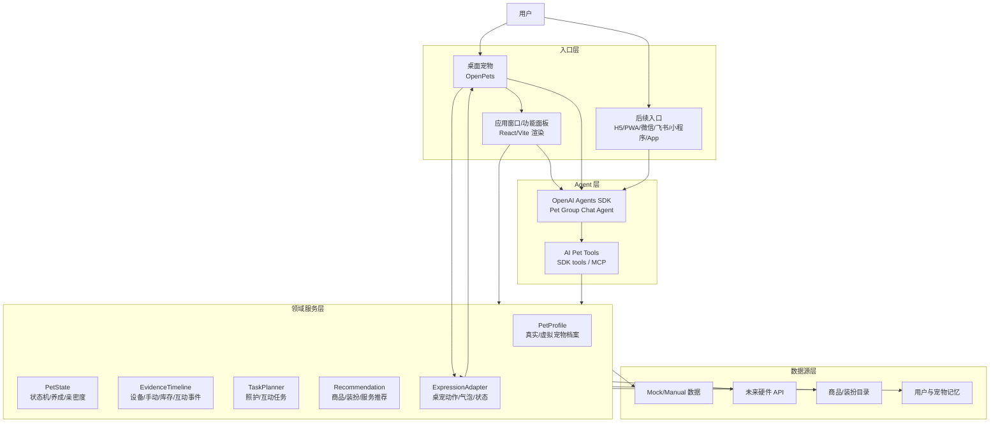

# AI Pet 技术架构

## 架构目标

当前目标是完成一版可运行的项目展示 Demo。架构必须服务开发闭环：

- 系统级桌宠和点击桌宠后弹出的应用窗口同时可用。
- 桌宠是核心入口，不只是输出窗口；复杂功能在应用窗口中完成，并同步回桌宠。
- 项目没有 HTML 展示页，不做静态网页看板或营销页。
- AI 能力接成熟 agent，不自研 agent 框架。
- 真实宠物数字分身和纯电子宠物共用领域模型。
- 多端入口复用同一业务服务和工具契约。

## 总体分层

## 当前实现状态

当前代码位于 `ai-pet/`：

- 应用窗口：Electron shell + React/Vite/TypeScript 渲染。产品口径是“桌宠点击后弹出的应用窗口/功能面板”，不是 HTML 展示页；当前视觉比例按手机屏幕长宽比实现，约 `430x932`。
- API：Express，端口 `127.0.0.1:8788`。
- 应用窗口开发端口：`127.0.0.1:5180`。
- 桌宠：OpenPets 运行时，通过本地 CLI/IPC 桥接。
- Domain：当前在前端 `src/domain/engine.ts` 和 mock 数据中实现，后续应抽成共享领域服务。
- AI：对话页宠物群聊主 Agent 方向已确定为 OpenAI Agents SDK。当前保留 `/api/ask` 作为早期照护问答接口；对话页应走 `/api/agent/chat`，由 OpenAI Agents SDK、科技狗 persona、主 thread/session 和业务 tools 驱动。

## 运行时边界

### 1. UI Channel

职责：

- 应用窗口负责密集信息、配置、任务列表、健康解释、陪伴对话、换装互动、库存和后续推荐。
- 桌宠负责常驻入口、主动提醒、轻交互、状态表达、点击展开应用窗口和 Agent 输出。
- 未来移动端、通讯软件和小程序只做入口，不复制业务逻辑。

禁止：

- 不把业务规则写死在单个端里。
- 不让某个端拥有另一端无法复用的独立状态。

### 2. Agent Runtime

职责：

- 使用成熟 agent 处理自然语言、工具选择、上下文组织和回复。
- 通过受控工具访问宠物业务数据。
- 触发任务规划、状态解释、桌宠表达和推荐。

当前方向：

- 对话页宠物群聊主 Agent：OpenAI Agents SDK。
- 工具暴露：OpenAI Agents SDK function tools，后续可继续扩展 MCP server 或等价工具协议。
- OpenCode / opencode：保留为后台工具、MCP 生态或开发 agent 参考，不作为宠物群聊主 Agent。

禁止：

- 不从零实现 agent loop、tool router、memory manager 或权限系统。
- 不把 AI 能力降级成普通 prompt 拼接聊天框。

### 3. Domain Service

职责：

- 统一管理真实宠物和纯电子宠物。
- 维护状态机、任务、证据流、库存、推荐和记忆。
- 给所有端和 agent tools 提供同一套 API。

当前迁移方向：

- 将 `src/domain/engine.ts` 中的规则抽离为共享服务。
- API 层逐步承接业务计算，应用窗口只负责呈现和交互。
- 所有 AI tools 只调用 Domain Service，不直接读写 UI 状态。

### 4. Desktop Runtime

职责：

- 使用 OpenPets 提供系统级宠物窗口。
- 支持气泡、动作、状态反应、pet pack 切换。
- 真实宠物形象必须优先保证和用户上传宠物一致；低保真程序化 3D 不满足当前展示要求。
- 真实宠物动态形象的当前正确资产结构是 motion manifest + 完整多帧动作序列；不要把单张照片整体晃动或拆四肢 rig 当作 Demo 主方案。
- 点击桌宠必须能打开应用窗口；提醒气泡和异常提示应能把用户带到对应窗口视图。
- 逐步把点击、拖拽、菜单、提醒确认等桌宠轻交互纳入主流程。

当前缺口：

- 已接 OpenPets built-in pet。
- 还需导入或生成项目专属宠物形象；当前补充了 `desktop-photo-pet` 作为照片级动态桌宠运行程序验证，并先通过 `public/assets/pets/mochi/motions/manifest.json` 播放 Mochi 走路 20 帧预览。
- 如果 OpenPets pet pack 不能承载足够真实的动态形象，需要扩展 OpenPets renderer 或采用独立桌面运行时承载照片级 2D/2.5D、Live2D/Rive/Spine 或高质量 glTF。
- 还需把桌宠从“同步按钮触发反馈”升级为“用户点击即可展开应用窗口的入口”。

## 桌宠与应用窗口联动协议

桌宠联动分成两套逻辑，完整协议见 [桌宠点击到应用窗口联动协议](desktop-pet-app-window-linkage-protocol-2026-05-30.md)。

### 基础跳转

用户点击桌宠、桌宠气泡、异常提醒或轻交互入口时，桌宠运行时发出打开应用窗口事件。Electron 应用窗口如果未启动则启动，如果已启动则聚焦；事件可以携带目标视图，默认进入陪伴对话页。

基础路由约定：

- 点击桌宠本体 -> `chat`
- 点击异常气泡 -> `status`
- 点击照护任务提醒 -> `tasks`
- 点击换装/装扮反馈 -> `outfit`

### 动作优先级

桌宠动作必须由 `ExpressionAdapter` 或后续 `MotionArbiter` 统一仲裁，不能让手环、应用窗口、agent 或桌宠随机动作直接抢占渲染器。对话页只和 agent 对话，不直接解析自然语言并控制动作；运动能力作为 `request_pet_motion` 工具暴露给 agent。

当前 MVP 仲裁顺序：

1. Agent 动作工具调用：最高优先级。用户在陪伴对话页说“请转个圈”等动作请求时，由 agent 决定是否调用 `request_pet_motion`；该工具调用覆盖所有低优先级动作。
2. 指令触发的随机动作：中优先级。agent、轻交互或演示指令触发随机动作池，覆盖默认状态，但不能覆盖 agent 的明确动作工具调用。
3. 手环/设备数据默认映射：基线优先级。动物手环记录真实宠物动作后，经领域状态映射到桌宠默认动作；这是应用窗口/领域状态对桌宠的影响。

高优先级动作完成或超时后，桌宠回到最新的手环/设备数据默认映射状态。

## 工具契约

Agent 必须通过工具访问业务能力。当前建议工具集：

### 宠物与状态

- `get_pet_profile`
- `update_pet_profile`
- `create_virtual_pet`
- `get_pet_state`
- `apply_interaction_event`

### 证据与健康

- `get_live_metrics`
- `record_metric`
- `record_care_event`
- `get_evidence_timeline`
- `summarize_health_trend`

### 任务

- `plan_daily_tasks`
- `complete_task`
- `explain_task_reason`

### 桌宠

- `virtual_pet_say`
- `virtual_pet_react`
- `virtual_pet_move`
- `virtual_pet_prompt_user`

### 对话与语音

- `get_main_thread`：读取单宠物唯一主群聊。
- `record_memory`：记录用户、宠物和事件记忆。
- `reply_with_voice`：当前回合返回语音消息；语音不是文字后处理。

### 商业与装扮

- `get_inventory`
- `record_inventory`
- `recommend_products`
- `get_outfit_catalog`
- `preview_outfit`

## 数据契约

核心数据对象：

- `PetProfile`：真实宠物档案或纯电子宠物设定。
- `PetState`：饱腹、心情、精力、清洁、亲密度、成长、当前动作和健康标记。
- `EvidenceEvent`：设备数据、手动记录、互动、库存变化、位置、图片/视频引用。
- `DailyTask`：照护任务、互动任务、推荐任务。
- `InventoryItem`：库存、剩余天数、适用宠物、禁忌。
- `ProductRecommendation`：触发原因、适配点、约束、替代项。
- `ExpressionCommand`：桌宠说话、动作、状态、提醒。

## 开发优先级

必须同时具备：

1. 系统级桌面宠物。
2. 桌宠点击后弹出的应用窗口/功能面板。
3. 成熟 Agent 接入业务 tools。
4. 真实宠物数字分身和纯电子宠物共用的状态模型。

下一步优先开发：

1. 把当前前端 domain 规则抽成可被 API 和 tools 复用的服务。
2. 接 OpenAI Agents SDK 到宠物群聊主 thread 和业务 tools。
3. 让桌宠成为可点击展开应用窗口的主入口，而不只是显示反馈。
4. 明确商品推荐和换装模块的最小可运行闭环。
5. 保持应用窗口 + 桌宠联动稳定，再扩展其他端口。

## 被新架构接管的旧表述

早期文档中以下说法不再作为当前架构真相：

- “纯电子宠物不要求进入当前架构第一闭环。”
- “桌宠只是可视化输出通道。”
- “第一版/第二阶段”的多版本表达。
- “安全边界是当前必须继续澄清的问题。”

当前以本文件和 `product-spec-2026-05-30.md` 为准。
