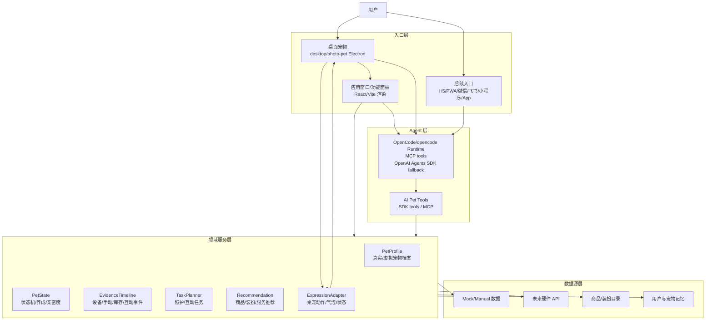

# AI Pet 技术架构

> 当前整体系统架构真相源见 [AI Pet 当前系统架构总览](current-system-architecture-2026-05-30.md)。本文保留技术分层、协议和工具契约细节；若执行入口、目录职责或验证标准有冲突，以当前系统架构总览为准。

## 架构目标

当前目标是完成一版可运行的项目展示 Demo。架构必须服务开发闭环：

- 系统级桌宠和点击桌宠后弹出的应用窗口同时可用。
- 桌宠是核心入口，不只是输出窗口；复杂功能在应用窗口中完成，并同步回桌宠。
- 项目没有 HTML 展示页，不做静态网页看板或营销页。
- AI 能力接成熟 agent，不自研 agent 框架。
- 真实宠物数字分身和纯电子宠物共用领域模型。
- 多端入口复用同一业务服务和工具契约。

## 总体分层



## 当前实现状态

当前代码位于 `ai-pet/`：

- 应用窗口：Electron shell + React/Vite/TypeScript renderer。产品口径是“桌宠点击后弹出的应用窗口/功能面板”，不是 HTML 展示页；当前视觉比例按手机屏幕长宽比实现，约 `430x932`。
- API：Express，端口 `127.0.0.1:8788`。
- 应用窗口开发端口：`127.0.0.1:5180`。
- 桌宠：当前默认开发入口使用 `desktop/photo-pet` 的照片级动态桌宠 Electron 进程；它同一进程内负责桌宠窗口、点击打开应用窗口、应用窗口打开时隐藏桌宠、应用窗口关闭时恢复桌宠。OpenPets 仅保留为历史调研材料，不再作为运行时备选或本地 CLI/IPC 桥接。
- Domain：当前在前端 `src/domain/engine.ts` 和 mock 数据中实现，后续应抽成共享领域服务。
- AI：当前对话主路径为 OpenCode/opencode runtime + MCP；OpenAI Agents SDK 只保留为 fallback。当前 Demo 的对话模型网关使用 llmmelon OpenAI-compatible Chat Completions，默认 `claude-sonnet-4-6`，`claude-opus-4-6` 已实测可用；语音工具使用阿里云百炼 Qwen Voice Design + Qwen TTS，Qwen key 不用于聊天模型。

## 当前实际运行架构

当前 Demo 的可运行架构必须按以下事实理解，不再按“前端 HTML 项目”理解：

| 层 | 当前实现 | 职责 | 验证入口 |
|---|---|---|---|
| 完整桌面入口 | `desktop/photo-pet/main.cjs` | 在同一个 Electron 进程内创建透明桌宠窗口和点击后的应用窗口；负责桌宠点击、拖拽、应用窗口打开时隐藏桌宠、应用窗口关闭时恢复桌宠 | `npm run dev` 或 `npm run dev:photo-pet` |
| 应用窗口 standalone 调试 | `desktop/app-window/main.cjs` | 只创建应用窗口，便于调试应用窗口 UI；不创建桌宠，不能验证桌宠显隐联动 | `npm run dev:app` |
| Renderer | `src/app/App.tsx`、`src/app/styles.css`、`index.html`、Vite dev server 或 `dist/index.html` | 被 Electron `BrowserWindow` 加载的应用窗口界面实现；技术上使用 HTML/CSS/React，但产品不是 HTML 展示页 | 浏览器只作 smoke test，最终验证必须回到 Electron 窗口 |
| 桌宠 renderer | `desktop/photo-pet/renderer.html`、`desktop/photo-pet/runtime.js` | 被透明桌宠 `BrowserWindow` 加载，播放照片级 Mochi motion manifest 动作帧并轮询动作/外观状态 | Electron 桌宠窗口 |
| API 与 Agent | `server/index.ts`、`server/agent.ts`、`server/opencodeAgent.ts`、`server/mcp.ts`、`server/appearance.ts`、`server/voice.ts` | 提供业务 API、OpenCode/opencode 对话主路径、AI Pet MCP tools、动作命令和外观状态；OpenAI Agents SDK 仅 fallback | `127.0.0.1:8788` |
| 领域模型 | `src/domain/*` | 当前共享的宠物档案、状态、mock 数据、动作和显示身份来源；后续继续抽成端无关 Domain Service | TypeScript 类型检查和 API/UI 联动验证 |

因此，React/Vite/HTML 是 Electron renderer 的实现方式；系统交付对象是桌面 App 链路：桌宠窗口 + 点击后应用窗口。`reports/` 下的 HTML 文件只允许作为历史报告或视觉证据，不作为当前产品入口。

### App 可用性判断规则

当前项目讨论“App 是否能用”时，默认指完整桌面 App 链路是否能用，而不是浏览器里某个 renderer 地址是否能打开。

- `http://127.0.0.1:5180/` 是 Vite renderer 调试地址。它可以帮助快速定位 UI 渲染问题，但不能代表桌宠 App 已运行。
- 完整开发态 App 必须用 `npm run dev` 启动，包含 API、renderer dev server 和 `desktop/photo-pet` Electron 桌宠进程。
- 完整交付态 App 必须直接启动 `release/mac-arm64/AI Pet Demo.app` 或解压后的 `.app`；打包 App 读取内置 `dist/index.html`，并由 `desktop/photo-pet/main.cjs` 启动 bundled API，因此不需要 `127.0.0.1:5180`。
- 完整验收必须能看到桌宠窗口、点击桌宠弹出应用窗口、关闭应用窗口恢复桌宠，并能在应用窗口内完成目标功能。
- 只启动 `npm run dev:renderer` 或只打开 Codex in-app browser，不算启动 App；只启动 `npm run dev:app` 也只能验证 standalone 应用窗口，不能验证桌宠入口。
- 如果用户当前看到的是 Codex in-app browser 或普通浏览器页面，应该主动说明这是 renderer 调试页面，并切回 Electron App 验证。

## 运行时边界

### 1. UI Channel

职责：

- 应用窗口负责密集信息、配置、任务列表、健康解释、陪伴对话、换装互动、库存和后续推荐。
- 桌宠负责常驻入口、主动提醒、轻交互、状态表达、点击展开应用窗口和 Agent 输出。
- 未来移动端、通讯软件和小程序只做入口，不复制业务逻辑。

禁止：

- 不把业务规则写死在单个端里。
- 不让某个端拥有另一端无法复用的独立状态。

### 2. Agent Runtime

职责：

- 使用成熟 agent 处理自然语言、工具选择、上下文组织和回复。
- 通过受控工具访问宠物业务数据。
- 触发任务规划、状态解释、桌宠表达和推荐。

当前 Agent 运行方式：

- 对话页宠物群聊主 Agent：OpenCode SDK / opencode runtime + MCP。
- 模型供应商：llmmelon New API/OpenAI-compatible `/v1/chat/completions`，默认 `claude-sonnet-4-6`；`claude-opus-4-6` 已实测可用；缺少 key 或 runtime 失败时才走 fallback。
- 工具暴露：AI Pet MCP tools；当前 OpenAI Agents SDK function tools 只作为 fallback。
- 语音供应商：百炼 `qwen-voice-design` 创建/复用科技狗自定义音色，`qwen3-tts-vd-2026-01-26` 合成语音；缺少 key 或供应商失败时回退浏览器语音播放。
- OpenAI Agents SDK：只作为 fallback，不是主 Agent 底座。

禁止：

- 不从零实现 agent loop、tool router、memory manager 或权限系统。
- 不把 AI 能力降级成普通 prompt 拼接聊天框。

### 3. Domain Service

职责：

- 统一管理真实宠物和纯电子宠物。
- 统一管理 App 端可编辑 settings，包括宠物身份、主人称呼、Persona、Prompt 补充和语音偏好。
- 维护状态机、任务、证据流、库存、推荐和记忆。
- 给所有端和 agent tools 提供同一套 API。

当前迁移方向：

- 将 `src/domain/engine.ts` 中的规则抽离为共享服务。
- 新增 settings/profile store 和 merged settings 纯函数；默认 `PetProfile` 和默认 Dog Persona 只作为初始值，不能继续被各端直接当作运行时真相。
- API 层逐步承接业务计算，应用窗口只负责呈现和交互。
- 所有 AI tools 只调用 Domain Service，不直接读写 UI 状态。

### 3.1 Settings 与 Prompt 合成

App 端编辑后的配置必须按以下顺序进入运行时：

```text
Default PetProfile + Default Dog Persona + User Overrides
  -> Merged Settings
  -> Runtime Snapshot / MCP / Prompt Adapter / TTS / Knowledge Base
```

Prompt 合成不能让用户完整覆盖底层系统 Prompt。不可编辑的底层边界包括工具调用规则、记忆规则、动作规则、工程词禁令和健康建议边界。用户可编辑内容只能作为 persona override、示例对话、禁忌表达和语音风格补充插入。

实现顺序必须是：先 settings store 与 merged settings，再替换后端 runtime/MCP/知识库读取点，再替换前端 profile 来源，最后做“我的 -> 宠物资料/对话设置” UI。

### 4. Desktop Runtime

职责：

- 当前 Demo 默认使用 `desktop/photo-pet` 提供系统级照片级桌宠窗口；OpenPets 不再保留运行入口，不是当前完整链路的验证对象。
- 支持气泡、动作、状态反应、pet pack 切换。
- 真实宠物形象必须优先保证和用户上传宠物一致；低保真程序化 3D 不满足当前展示要求。
- 真实宠物动态形象的当前正确资产结构是 motion manifest + 完整多帧动作序列；不要把单张照片整体晃动或拆四肢 rig 当作 Demo 主方案。
- 点击桌宠必须能打开应用窗口；提醒气泡和异常提示应能把用户带到对应窗口视图。
- 逐步把点击、拖拽、菜单、提醒确认等桌宠轻交互纳入主流程。

当前缺口：

- 已导入项目专属 Mochi 桌宠形象；当前默认用 `desktop/photo-pet` 作为照片级动态桌宠运行程序，并通过 `public/assets/pets/mochi/motions/manifest.json` 播放 12 个动作、284 张透明帧的 v1 完整动作包。应用窗口内对话页、状态页和我的装扮大预览也复用同一份 motion manifest 和透明帧，避免再出现程序化 CSS mock 形象。
- OpenPets built-in pet 不得作为当前 Demo 的运行入口；相关运行脚本、API 桥接和旧 UI 已从项目中删除。
- 如果未来重新评估 OpenPets 或其它桌宠底座，必须先证明它承载当前照片级小狗动作帧、点击联动和应用窗口生命周期控制，再重新进入架构。
- 还需把桌宠从“同步按钮触发反馈”升级为“用户点击即可展开应用窗口的入口”。

## 桌宠与应用窗口联动协议

桌宠联动分成两套逻辑，完整协议见 [桌宠点击到应用窗口联动协议](desktop-pet-app-window-linkage-protocol-2026-05-30.md)。

### 基础跳转

用户点击桌宠、桌宠气泡、异常提醒或轻交互入口时，桌宠运行时发出打开应用窗口事件。Electron 应用窗口如果未启动则启动，如果已启动则聚焦；事件可以携带目标视图。没有显式目标视图时，默认进入欢迎/开始陪伴初始页；用户点击“开始陪伴”后进入陪伴对话页。

基础路由约定：

- 点击桌宠本体 -> `welcome`
- 欢迎页点击“开始陪伴” -> `chat`
- 点击异常气泡 -> `status`
- 点击照护任务提醒 -> `my` 下的用户激励每日任务详情页
- 点击换装/装扮反馈 -> `my` 页内装扮区

当前 `desktop/photo-pet` 集成入口还承担窗口显隐：应用窗口创建或聚焦时隐藏桌宠窗口；应用窗口关闭时恢复桌宠窗口。`desktop/app-window/main.cjs` 仅作为 standalone 应用窗口调试入口，不用于验证桌宠显隐联动。

### 动作优先级

桌宠动作必须由 `ExpressionAdapter` 或后续 `MotionArbiter` 统一仲裁，不能让手环、应用窗口、agent 或桌宠随机动作直接抢占渲染器。对话页只和 agent 对话，不直接解析自然语言并控制动作；运动能力作为 `request_pet_motion` 工具暴露给 agent。

当前 MVP 仲裁顺序：

1. Agent 动作工具调用：最高优先级。用户在陪伴对话页说“请转个圈”等动作请求时，由 agent 决定是否调用 `request_pet_motion`；该工具调用覆盖所有低优先级动作。
2. 指令触发的随机动作：中优先级。agent、轻交互或演示指令触发随机动作池，覆盖默认状态，但不能覆盖 agent 的明确动作工具调用。
3. 手环/设备数据默认映射：基线优先级。动物手环记录真实宠物动作后，经领域状态映射到桌宠默认动作；这是应用窗口/领域状态对桌宠的影响。

高优先级动作完成或超时后，桌宠回到最新的手环/设备数据默认映射状态。

## 工具契约

Agent 必须通过工具访问业务能力。当前建议工具集：

### 宠物与状态

- `get_pet_profile`
- `update_pet_profile`
- `get_pet_settings`
- `update_pet_settings`
- `update_pet_persona`
- `create_virtual_pet`
- `get_pet_state`
- `apply_interaction_event`

### 证据与健康

- `get_live_metrics`
- `record_metric`
- `record_care_event`
- `get_evidence_timeline`
- `summarize_health_trend`

### 任务

- `plan_daily_tasks`
- `complete_task`
- `explain_task_reason`
- `get_user_incentive_summary`
- `get_reward_unlocks`

### 桌宠

- `virtual_pet_say`
- `virtual_pet_react`
- `virtual_pet_move`
- `virtual_pet_prompt_user`

### 对话与语音

- `get_main_thread`：读取单宠物唯一主群聊。
- `record_memory`：记录用户、宠物和事件记忆。
- `reply_with_voice`：当前回合返回语音消息；当前实现优先用 Qwen TTS 合成，语音不是文字后处理。
- `preview_persona_reply`：用当前 settings 生成测试回复，不写入主 thread，用于设置页验证。

### 商业与装扮

- `get_inventory`
- `record_inventory`
- `recommend_products`
- `get_outfit_catalog`
- `preview_outfit`
- `get_outfit_unlock_state`

当前展示阶段的桌宠真实换装接口只保存配饰状态，不保存服装、毛发或妆容状态。应用窗口保存配饰后写入 `PetAppearanceState`；该状态是我的页、对话页、状态页和桌面桌宠的单一外观真相源，Demo 阶段由 `server/appearance.ts` 持久化到 `.ai-pet-data/appearance.json`。照片级桌宠运行时读取该状态，并按当前配饰选择对应的完整动作帧图；应用窗口关闭后也必须强制刷新一次外观状态。服装、毛发、妆容如果出现在应用窗口中，只能作为页面预览或后续方案，不进入真实桌宠渲染契约。

## 数据契约

核心数据对象：

- `PetProfile`：真实宠物档案或纯电子宠物设定。
- `PetState`：饱腹、心情、精力、清洁、亲密度、成长、当前动作和健康标记。
- `EvidenceEvent`：设备数据、手动记录、互动、库存变化、位置、图片/视频引用。
- `DailyTask`：照护任务、互动任务、推荐任务。
- `InventoryItem`：库存、剩余天数、适用宠物、禁忌。
- `ProductRecommendation`：触发原因、适配点、约束、替代项。
- `ExpressionCommand`：桌宠说话、动作、状态、提醒。
- `PetSettings`：App 端保存的宠物身份、主人称呼、Persona、Prompt 补充和语音偏好 override。
- `MergedPetSettings`：由默认 profile/persona 与 `PetSettings` 合成的运行时配置，是 Agent、MCP、TTS、知识库和应用窗口共同读取的配置真相。

## 开发优先级

必须同时具备：

1. 系统级桌面宠物。
2. 桌宠点击后弹出的应用窗口/功能面板。
3. 成熟 Agent 接入业务 tools。
4. 真实宠物数字分身和纯电子宠物共用的状态模型。
5. App 端可编辑宠物资料、主人称呼、Persona 和 Prompt 补充，并能持久化同步到完整桌宠 App 链路。

下一步优先开发：

1. 先实现 settings/profile store、merged settings 纯函数和 settings API。
2. 替换后端 runtime、MCP、知识库、TTS 和主动事件里的静态 `petProfiles[0]` 读取点。
3. 替换前端 App 的静态 profile 来源，再实现“我的 -> 宠物资料/对话设置” UI。
4. 把当前前端 domain 规则抽成可被 API 和 tools 复用的服务。
5. 继续扩大 AI Pet MCP tools 的覆盖面；对话页 `/api/agent/chat` 主路径已经接入 OpenCode/opencode，OpenAI Agents SDK 路径仅保留为 fallback。
6. 保持应用窗口 + 桌宠联动稳定，再扩展其他端口。

## 被新架构接管的旧表述

早期文档中以下说法不再作为当前架构真相：

- “纯电子宠物不要求进入当前架构第一闭环。”
- “桌宠只是可视化输出通道。”
- “第一版/第二阶段”的多版本表达。
- “安全边界是当前必须继续澄清的问题。”

当前以本文件和 `product-spec-2026-05-30.md` 为准。
