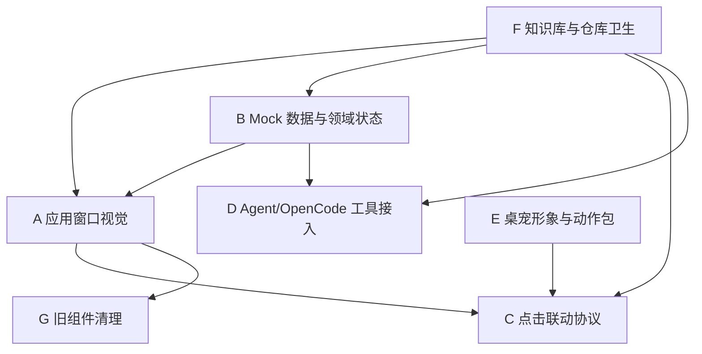

# AI Pet 并行开发工作流

## 目的

这份文档用于后续多个对话并行开发。每个新对话应先读本文件，明确自己领取的工作流、可修改文件、不能触碰的文件和验收标准。

当前产品口径必须保持一致：

- AI Pet 不是 HTML 展示页，也不是营销站。
- 第一入口是系统级桌面宠物。
- 点击桌宠后打开的是桌面程序应用窗口/宠物面板。
- 当前阶段先用 mock 数据把视觉和展示闭环跑通；真实后台、agent runtime、设备数据和持久化后续接入。
- 桌宠形象端和应用窗口端可以并行，但必须按文件边界协作。

## 每个并行对话必读

1. 根索引：`docs/INDEX.md`
2. 项目索引：`ai-pet/docs/INDEX.md`
3. 产品规格：`ai-pet/docs/product/product-spec-2026-05-30.md`
4. 技术架构：`ai-pet/docs/architecture/technical-architecture-2026-05-30.md`
5. 桌宠联动协议：`ai-pet/docs/architecture/desktop-pet-app-window-linkage-protocol-2026-05-30.md`
6. 模块索引：`ai-pet/docs/modules/INDEX.md`
7. 目录地图：`ai-pet/docs/knowledge-base/project-directory-map-2026-05-30.md`
8. 展示协调：`ai-pet/docs/plan/display-development-coordination-2026-05-30.md`
9. 本文件：`ai-pet/docs/plan/parallel-development-workstreams-2026-05-30.md`

## 全局协作规则

- 开始前必须执行 `git status --short`，识别其他开发线的未提交改动。
- 不要回滚、格式化或重写自己工作流之外的文件。
- 应用窗口端默认不修改 `desktop/photo-pet/`、`public/assets/pets/mochi/motions/`、`scripts/motion_pack/` 和 `reports/desktop-photo-pet-*`。
- 桌宠形象端默认不修改 `src/app/App.tsx`、`src/app/styles.css`、`desktop/app-window/` 和应用窗口截图报告。
- 共享领域数据修改必须保持 `src/domain/` 的纯函数和类型边界，不能把完整后台、agent loop 或远程服务塞进 React 组件。
- 每个工作流完成后必须更新相关知识库文档或实施记录，不能只改代码。
- 视觉类工作必须留下截图证据；入口和联动类工作必须留下可复现的启动/点击/日志证据。

## 工作流 A：应用窗口视觉与交互完善

### 目标

把点击桌宠后弹出的应用窗口做成手机屏幕比例的桌面应用面板，先用 mock 数据完成纯展示效果。

### 范围

- 对话页：类似微信的上下文聊天窗口。
- 状态页：今日状态、健康数据、异常报告和趋势在同一页。
- 初始页：欢迎/介绍页，包含“毛球伙伴”和“开始陪伴”按钮。
- 底部入口：市集、社区、对话、状态、我的五个入口，顺序与参考 App 对齐。
- 我的页：mock 换装和宠物个人入口。
- Electron 窗口比例：保持接近手机屏幕长宽比。
- 交互 mock：市集分类/商品详情、社区搜索/帖子详情、状态日期/健康报告、我的页装扮分类/保存都必须可点击并有可见反馈。

### 优先文件

- `ai-pet/src/app/App.tsx`
- `ai-pet/src/app/styles.css`
- `ai-pet/desktop/app-window/main.cjs`
- `ai-pet/vite.config.ts`
- `reports/application-window-ui-2026-05-30/`
- `ai-pet/docs/plan/implementation-log-2026-05-30.md`

### 禁止/谨慎

- 不做桌宠照片级形象、动作帧和透明窗口调参。
- 不把应用窗口当成浏览器 HTML 展示页。
- 不改桌宠形象线正在使用的 `desktop/photo-pet/`。

### 验收

- `npm run typecheck` 通过。
- `npm run build` 通过。
- Electron 加载构建产物不空白。
- 430x932 或接近手机比例截图覆盖欢迎页、市集、社区、对话、状态、我的六个状态。
- Playwright 点击覆盖市集分类、商品详情、社区搜索、帖子详情、状态日期、健康报告、我的页装扮分类和保存。
- console 和 network 没有影响展示的错误。

## 工作流 B：Mock 数据与领域状态整理

### 目标

把展示所需的宠物档案、健康状态、异常、任务、对话、换装和推荐数据整理为稳定的领域层，供应用窗口、桌宠入口和后续 agent tools 复用。

### 范围

- 真实宠物数字分身与纯 AI 电子宠物两类口径。
- mock 健康数据、手动记录、异常解释、照护任务和换装状态。
- 纯函数状态计算、任务派生、异常摘要和推荐入口。
- 明确哪些数据是当前 mock，哪些是后续真实服务字段。

### 优先文件

- `ai-pet/src/domain/types.ts`
- `ai-pet/src/domain/mockData.ts`
- `ai-pet/src/domain/engine.ts`
- `ai-pet/src/app/App.tsx` 中只做必要接入。
- `ai-pet/docs/architecture/technical-architecture-2026-05-30.md`
- `ai-pet/docs/modules/INDEX.md`

### 禁止/谨慎

- 不在领域层直接调用 Electron、DOM、网络或模型 API。
- 不把 mock 写死在多个 UI 组件里。
- 修改类型时需要确认应用窗口仍能完整渲染。

### 验收

- `npm run typecheck` 通过。
- `npm run build` 通过。
- 应用窗口四个页签仍能渲染同一份领域数据。
- 知识库明确记录 mock 到真实数据的迁移路径。

## 工作流 C：桌宠点击到应用窗口联动协议

### 目标

把系统级桌宠作为第一入口，完成两套联动协议：点击或触发桌宠后打开应用窗口的基础跳转协议，以及桌宠动作来源的优先级仲裁协议。

### 范围

- 基础跳转逻辑：桌宠点击打开或聚焦应用窗口。
- 基础跳转逻辑：支持打开默认对话页、状态页、用户激励每日任务子页、我的页装扮区或异常详情。
- 基础跳转逻辑：明确 Electron IPC、本地协议或本地服务桥接方式。
- 动作联动逻辑：定义 `ExpressionCommand` 或等价动作命令字段。
- 动作联动逻辑：把 `request_pet_motion` 或等价接口暴露给 agent，由 agent 决定是否触发动作。
- 动作联动逻辑：按 `agent 动作工具调用 > 指令触发的随机动作 > 手环/设备数据默认映射` 仲裁。
- 动作联动逻辑：为手环状态映射、随机动作和 agent 工具调用覆盖预留事件入口。

### 优先文件

- `ai-pet/desktop/app-window/`
- `ai-pet/server/openpets.ts`
- `ai-pet/src/domain/types.ts`
- `ai-pet/docs/architecture/technical-architecture-2026-05-30.md`
- `ai-pet/docs/architecture/desktop-pet-app-window-linkage-protocol-2026-05-30.md`
- `ai-pet/docs/plan/display-development-coordination-2026-05-30.md`

### 禁止/谨慎

- 该工作流会碰到桌宠形象线边界。若需要改 `desktop/photo-pet/`，必须确认当前对话明确领取了联动工作，且先检查该目录是否有他人未提交改动。
- 不在联动协议里耦合具体宠物动作帧生成逻辑。
- 不让应用窗口、agent 或手环数据绕过动作仲裁直接控制桌宠渲染器。
- 不在对话页组件里直接解析“转圈/跳一下”等自然语言并控制桌宠；这些必须走 agent 工具接口。

### 验收

- 可通过桌宠点击或等价本地触发打开应用窗口。
- 可传入目标页签并正确落到应用窗口。
- 可用 mock 命令证明三类动作来源的优先级：agent 动作工具调用覆盖随机动作和手环默认映射；随机动作覆盖手环默认映射；动作结束后回到手环默认映射。
- 有日志或截图证明入口链路可复现。
- `npm run typecheck` 和 `npm run build` 通过。

## 工作流 D：Agent/OpenCode Runtime 与工具接入

### 目标

用成熟 agent runtime 或工具协议接入 AI 能力，不从零手写 agent 框架。当前方向是 OpenCode SDK / opencode runtime + MCP 或等价工具协议。

### 范围

- 定义宠物档案、健康状态、任务、换装和推荐的工具接口。
- agent 可以读取当前 mock/domain 数据并生成解释、建议或对话回复。
- 保留本地 fallback，避免展示时因外部 API 不稳定导致应用不可用。
- 记录 key、模型和 runtime 选择，但不在聊天或文档中回显私有凭证。

### 优先文件

- `ai-pet/server/`
- `ai-pet/src/domain/`
- 可新增 `ai-pet/server/tools/` 或等价目录。
- `ai-pet/docs/architecture/technical-architecture-2026-05-30.md`
- `ai-pet/docs/modules/INDEX.md`
- `ai-pet/docs/plan/implementation-log-2026-05-30.md`

### 禁止/谨慎

- 不把模型调用直接写在 `src/app/App.tsx`。
- 不把私有 key 写入仓库或知识库。
- 不把未完成 agent 能力描述为已完成后台。

### 验收

- 至少一个工具调用能读取宠物状态或任务数据。
- 应用窗口可展示 agent/fallback 生成的 mock 回复或解释。
- 本地无 key 时仍能启动并展示 mock 结果。
- 架构文档记录 runtime、工具边界和后续迁移路径。

## 工作流 E：桌宠形象与动作包线

### 目标

负责桌面端宠物本体的视觉、动作、透明窗口、常驻位置和基础互动表现。

### 范围

- 桌宠照片级或真实宠物分身形象。
- 多帧动作、走路、待机、反馈动画。
- 透明桌面窗口、可拖动、状态表达和轻交互。

### 优先文件

- `ai-pet/desktop/photo-pet/`
- `ai-pet/public/assets/pets/mochi/`
- `ai-pet/scripts/motion_pack/`
- `reports/desktop-photo-pet-*`
- `ai-pet/docs/research/desktop-real-pet-avatar-2026-05-30.md`
- `ai-pet/docs/plan/desktop-pet-motion-pack-plan-2026-05-30.md`

### 禁止/谨慎

- 这个工作流当前由另一条开发线处理。应用窗口对话不要主动修改这些文件。
- 不改应用窗口布局，除非任务明确包含桌宠到应用窗口联动。

### 验收

- 桌面端能看到宠物形象。
- 动作不是简单静态 cutout 上下晃动，而是符合当前动作包计划的多帧表现。
- 有截图、GIF 或运行证据归档到 `reports/desktop-photo-pet-*`。

## 工作流 F：知识库与仓库卫生

### 目标

保证多对话并行开发时知识库、目录、报告和索引始终可用，避免后续对话读到过期事实。

### 范围

- `docs/INDEX.md` 与 `ai-pet/docs/INDEX.md`。
- 产品规格、架构、模块、计划、修复记录和 `_GAP.md`。
- `reports/` 目录归档规则。
- 根目录临时文件、截图和旧报告整理。

### 优先文件

- `docs/INDEX.md`
- `ai-pet/docs/INDEX.md`
- `ai-pet/docs/_GAP.md`
- `ai-pet/docs/knowledge-base/project-directory-map-2026-05-30.md`
- `reports/README.md`

### 禁止/谨慎

- 不删除历史报告，除非用户明确要求。
- 不把报告产物当成产品真相源。
- 不移动他人正在使用的动作素材、运行脚本或截图证据。

### 验收

- 新增/变更文档都能从索引进入。
- 知识库中没有把 HTML 看板描述为当前产品入口。
- `_GAP.md` 记录仍未解决的问题。
- 根目录没有新增临时截图或日志。

## 工作流 G：过时 MVP 组件清理

### 目标

已完成。当前项目只有一个 App，不保留旧宽屏 MVP 或旧源码目录，避免后续并行开发误读。

### 范围

- `ai-pet/src/components/` 只保留当前 App 实际引用的组件。
- `ai-pet/src/app/App.tsx` 和 `ai-pet/src/app/styles.css` 是应用窗口唯一主入口。
- 过时组件已删除，不再迁移到任何旧源码目录。

### 优先文件

- `ai-pet/src/components/`
- `ai-pet/src/app/App.tsx`
- `ai-pet/docs/knowledge-base/project-directory-map-2026-05-30.md`
- `ai-pet/docs/_GAP.md`

### 禁止/谨慎

- 不要重新创建旧源码目录。
- 不要恢复旧宽屏 MVP 组件作为备用入口。

### 验收

- `rg "旧宽屏|早期宽屏" ai-pet/src` 无结果。
- `npm run typecheck` 和 `npm run build` 通过。
- 目录地图和 `_GAP.md` 同步更新。

## 推荐并行顺序

第一批可以并行：

1. 工作流 A：应用窗口视觉与交互完善。
2. 工作流 B：Mock 数据与领域状态整理。
3. 工作流 E：桌宠形象与动作包线。
4. 工作流 F：知识库与仓库卫生。

第二批在第一批基础上推进：

1. 工作流 C：桌宠点击到应用窗口联动协议。
2. 工作流 D：Agent/OpenCode Runtime 与工具接入。

暂缓：

1. 无。工作流 G 已完成，不再暂缓。

## 依赖关系



## 后续对话启动模板

应用窗口视觉对话：

```text
请先读取 AI Pet 知识库和并行开发工作流，领取工作流 A：应用窗口视觉与交互完善。只处理点击桌宠后弹出的桌面程序应用窗口，不处理桌宠形象。
```

Mock 数据/领域层对话：

```text
请先读取 AI Pet 知识库和并行开发工作流，领取工作流 B：Mock 数据与领域状态整理。重点整理 src/domain，不要改桌宠形象线文件。
```

桌宠形象对话：

```text
请先读取 AI Pet 知识库和并行开发工作流，领取工作流 E：桌宠形象与动作包线。只处理 `desktop/photo-pet/`、宠物素材和动作报告，不改应用窗口布局。
```

联动协议对话：

```text
请先读取 AI Pet 知识库和并行开发工作流，领取工作流 C：桌宠点击到应用窗口联动协议。改动前先检查桌宠形象线和应用窗口线的未提交文件。
```

Agent 接入对话：

```text
请先读取 AI Pet 知识库和并行开发工作流，领取工作流 D：Agent/OpenCode Runtime 与工具接入。不要从零写 agent 框架，不要在仓库里写入私有 key。
```

知识库/仓库卫生对话：

```text
请先读取 AI Pet 知识库和并行开发工作流，领取工作流 F：知识库与仓库卫生。负责索引、目录地图、GAP 和报告归档，不移动他人正在开发的素材。
```
