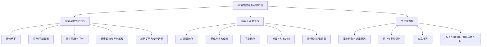

# AI 宠物产品定位与讨论框架

> 本文是会议摘要和决策链记录，不再作为当前产品真相源。当前已批准产品规格见 [AI Pet 当前产品规格](product-spec-2026-05-30.md)；技术架构见 [AI Pet 技术架构](../architecture/technical-architecture-2026-05-30.md)；MVP 入口和功能结构见 [MVP 功能设计对齐](../plan/mvp-feature-design-2026-05-30.md)。本文中的早期“网页端/Web 控制台”表述均按“桌宠点击后弹出的应用窗口/功能面板”理解。

## 会议结论摘要

2026-05-30 会议的核心任务是把此前较泛的 AI 宠物方向收敛成可开发、可分工、可运行验证的产品框架。

讨论形成的上位定位是：产品不先从硬件项圈、宠物医疗或泛桌宠出发，而是从人的情感陪伴需求出发，使用宠物形象承载 AI 陪伴、照护解释、虚拟养成和商业推荐。

在这个上位定位下，产品分成两条主线：

1. 真实宠物关联主线：面向已有宠物的人，把真实宠物档案、行为数据、照护记录和健康趋势喂给 AI，让用户感觉是在和自己的宠物互动。
2. 纯电子宠物主线：面向没有真实宠物但有陪伴需求的人，提供一个可聊天、可养成、可互动、可装扮的 AI 虚拟宠物。

现有 MVP 文档中的“真实宠物数字分身”不再是唯一产品解释口径；它应被放入更大的“AI 情感陪伴型宠物产品”框架中。2026-05-30 用户已进一步确认：AI 电子宠物陪伴和真实宠物数字分身共存，电子宠物可以是虚拟宠物，也可以是真实宠物在系统中的分身。

## 讨论中的问题链

### 1. 先定产品定位

会议一开始识别出两个可能方向：

- 宠物出发：围绕真实宠物、问诊、硬件项圈、健康监测、照护管理展开。
- 人出发：围绕人的孤独感、情绪陪伴、虚拟宠物人格、互动玩法和长期留存展开。

最终更倾向第二种：从人的情感陪伴需求出发，再把真实宠物数据和硬件作为增强能力接入。

### 2. 再定目标受众

会议把目标人群划分为两类：

- 已有真实宠物的人：希望更好地理解、照护、记录和陪伴自己的宠物。
- 没有真实宠物的人：希望获得一个低门槛、可互动、有情绪价值的电子宠物。

这两类人共用 AI 陪伴和宠物形象，但产品任务不同。前者重“真实数据、照护解释、健康报告、宠物电商”，后者重“陪伴、养成、玩法、装扮、情绪价值”。

### 3. 再拆产品板块

会议形成了一个初步功能分类：

- AI 宠物聊天与陪伴：核心入口，用户通过对话、状态反馈和桌宠表达建立关系。
- 真实宠物数据绑定：档案、喂养、饮水、睡眠、心率、体温、活动、GPS、安全围栏、抓挠/吠叫等。
- AI 健康与照护解释：不是只展示数据，而是把一周或一个月的数据生成报告、异常解释和照护建议。
- 日常照护记录：饮食、换粮、用药、护理、遛狗、清洁等可形成问诊和复盘证据。
- 纯电子宠物养成：聊天、互动、状态成长、排行榜、任务和持续升级。
- 宠物换装与电商：虚拟试装、同款推荐、定制宠物服装、用品推荐和商业转化。
- 多端入口：系统级桌宠、桌宠点击后弹出的应用窗口，以及未来可能接入飞书、微信等通讯软件。

### 4. 最后定分工与下一步

会议末尾形成的工作方式是：

- 真实宠物方向继续细化需要解决的真实需求、数据范围和硬件能力。
- 纯电子宠物方向细化玩法、卖点、交互和留存机制。
- 技术与调研方向继续寻找可复用开源项目、可借鉴产品、桌面端/通讯软件接入方案。
- 下午继续对齐各板块功能，晚上围绕可运行 Demo 收敛产品定义、功能闭环和工程实现。

## 产品分类框架

## Demo 开发对齐建议

当前实现和既有文档更适合优先跑通真实宠物用户的 Demo 主路径，但不能把纯电子宠物排除为另一个产品：

1. 使用真实宠物档案创建虚拟宠物形象。
2. 使用 mock 设备数据和手动记录驱动宠物状态。
3. 生成今日照护任务、健康趋势解释和商品推荐。
4. 通过桌宠窗口和点击后弹出的应用窗口展示 AI 互动。
5. 在同一套领域模型中保留纯电子宠物入口，说明它与真实宠物数字分身共用状态、记忆、互动、桌宠和 Agent 能力。

当前已确认：纯电子宠物不应作为不相关扩展或远期概念处理；它是同一产品的另一类宠物来源。当前开发优先级是系统级桌宠 + 点击桌宠后弹出的应用窗口先跑通；项目没有 HTML 展示页。

## 需要继续澄清的开发问题

- 纯电子宠物在当前 Demo 中需要开发到什么程度：独立角色、独立入口，还是先复用真实宠物分身状态系统？
- 换装和电商在 Demo 中的最小可运行闭环是什么：任务/库存触发推荐、电子宠物装扮、真实宠物试装或同款推荐？
- 多端入口在桌宠 + 应用窗口之后优先接哪个：移动端 H5/PWA、飞书/微信消息入口、小程序或手机 App？
- OpenCode SDK / opencode runtime 的具体接入方式、启动脚本、tool schema 和运行验证如何落地？
- 健康报告在功能上做到什么粒度：单日解释、周报/月报、异常归因、问诊证据导出分别要不要开发？
