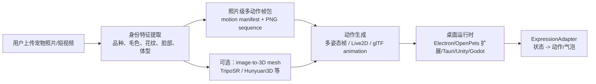

# 真实宠物桌面形象路线

## 会议约束

2026-05-30 MVP 功能设计讨论已经明确：

- 真实宠物和电子宠物共存；真实宠物分身和纯电子宠物前端视角尽量统一，主要差异是数据来源。
- 桌宠入口需要和真实宠物主体形象对应，不能只用无关的默认动物。
- 团队理想方案是“生成最心爱的宠物的真实 3D 形象”，但当前开源项目精细度不够，第一版不能阻塞在完整 3D 建模、骨骼绑定和动作库。
- 若真实 3D 不可行，会议接受卡通/Q 版作为退路；但当前 Demo 更适合走“照片级特征 + 2.5D 桌宠 sprite”的中间路线。

## 当前修正结论

当前目标不是“任意 3D”，而是**必须和真实宠物高度对齐**。维度不是第一优先级，真实性和可动性才是第一优先级。

当前可接受路线：

**用户上传照片 -> 提取宠物身份特征 -> 生成照片级多动作帧包 -> 桌面透明窗口按 motion manifest 播放完整帧序列 -> 后续再升级高质量 3D mesh/rig。**

明确排序：

1. **高保真照片级 2D/2.5D 动态桌宠**：当前 Demo 主路线。
2. **高质量 3D mesh + rig 动态桌宠**：后续增强路线，只有在能保持真实宠物一致性时才升级。
3. **低保真程序化 3D 模型**：错误方向，不应作为展示方案。

当前桌面端补充实现：

- `ai-pet/desktop-photo-pet/`：Electron 透明/无边框/置顶桌面窗口。
- `npm run dev:photo-pet`：启动照片级动态桌宠。
- `ai-pet/public/assets/pets/mochi/mochi-corgi-realistic-v1.png`：当前照片级 Mochi cutout 占位资产。
- `ai-pet/public/assets/pets/mochi/motions/manifest.json`：当前 Mochi v1 完整动作包清单，12 个动作、284 张透明帧。
- `ai-pet/public/assets/pets/mochi/motions/*-v1/*.png` 与 `motions/walk-v2/*.png`：当前照片级多动作透明帧。

动作系统修正：

- 不再把同一张宠物图做整体上下晃动作为主动作。
- 不再把四肢切成固定局部图片在运行时 rig 变形作为当前 Demo 主方案。
- 当前 Demo 使用“完整帧 PNG 序列 + manifest + 状态机播放”的结构。运行时只负责按动作帧率、循环策略和状态切换播放完整帧。
- 当前已展示第一批 12 个动作，均为完整透明帧序列。
- 生产链路应由照片/短视频/生成模型输出更真实的多姿态帧，不能用单张图缩放、压扁、翻转或局部 rig 冒充动作。

## 本次 Demo 的复用边界

`reports/desktop-pet-avatar-demo/` 只是上一轮用于验证“真实宠物桌面形象”的视觉原型：

- **没有 fork 或复制任何开源项目代码。**
- **没有导入 OpenPets pet pack 到桌面运行时。**
- **没有使用 BongoCat、AI-Desktop-Pet、Live2D 或 Rive 的代码和模型。**
- HTML/CSS 展示原型是本项目新写的。
- Mochi 柯基 PNG 是本次新生成并去背的项目资产。

当前新增 `ai-pet/desktop-photo-pet/` 是桌面运行程序验证，不再依赖浏览器打开 HTML 页面。它内部使用 Electron 渲染透明桌面窗口，但产品形态是桌面端运行程序。

真正参考的开源项目仍是 **OpenPets**，但它的边界要重新说明。参考范围是：

- 系统级桌宠窗口作为 MVP 底座。
- `pet.json` + `spritesheet.webp` 这类 pet package 思路。
- MCP/CLI/IPC 驱动 `say/react/status` 的控制链路。
- OpenPets 能作为“表达外壳”，AI Pet 自己负责真实宠物档案、状态机、任务和 AI 解释。

如果 OpenPets 当前形象包仍以 spritesheet 为主，则可以承接照片级 2D/2.5D 动态路线；若要高质量 3D，则需要扩展 OpenPets renderer 或采用独立桌面 3D/2.5D runtime。

BongoCat 和 AI-Desktop-Pet 不是本次 Demo 的实现来源，只是说明未来如果要做 Live2D/模型导入和更细动作，可以参考它们的表达层方向。

不采用：

- 第一版直接做无法对齐真实宠物的低保真 3D 数字宠物。
- 只用 OpenPets built-in pet 作为最终展示。
- 把桌宠做成普通网页卡片或静态头像。

理由：

- 用户最新纠偏说明：不真实的 3D 是错误方向，照片级 2D 平面也可以，但必须能动。
- OpenPets 已能提供系统级桌宠窗口、pet asset、MCP/CLI/IPC 控制链路，适合作为运行底座或被扩展为表达外壳。
- 照片级 sprite 可以先保持真实宠物一致性，再用呼吸、轻微位移、气泡和状态图模拟“活着”的感觉。
- 完整 3D 或 Live2D 猫狗模型需要照片采集、建模/拆图、绑定、动作和授权流程；只有在生成质量足够贴近真实宠物时才应进入主路径。

## 可参考对象

| 方向 | 参考 | 可借鉴点 | 当前用法 |
|---|---|---|---|
| 桌宠运行时 | OpenPets | 桌面窗口、pet package、本地 IPC、MCP tools、气泡和 reaction | MVP 主底座参考；真实高保真形象可能需要扩展 renderer |
| 高级 2D 动作 | BongoCat / AI-Desktop-Pet / Live2D Cubism SDK | 动作包、表情、物理、动作播放 | 后续“高级形象模式”；本次未使用 |
| 状态机驱动动画 | Rive Runtime | app 状态驱动交互动画，跨端 runtime | 后续可用于轻量矢量 UI/表情；本次未使用 |
| 照片到 3D | TripoSR / Hunyuan3D | 单图或多图生成 mesh、PBR 纹理、glTF/OBJ 导出 | 后续生成链路候选；当前先不实现 |
| 桌面存在感 | EMO、Moflin、aibo | 小动作、主动 check-in、眼神和非语言反馈 | 作为表现节奏参考，不做硬件模拟 |

## Demo 资产

本次已生成 Mochi 柯基桌宠形象：

- 源图：`reports/desktop-pet-avatar-demo/mochi-corgi-green.png`
- 透明图：`reports/desktop-pet-avatar-demo/mochi-corgi-cutout.png`
- 应用资产：`ai-pet/public/assets/pets/mochi/mochi-corgi-realistic-v1.png`
- 动作包：`ai-pet/public/assets/pets/mochi/motions/manifest.json`
- 动作 manifest：`ai-pet/public/assets/pets/mochi/motions/manifest.json`
- 走路透明帧：`ai-pet/public/assets/pets/mochi/motions/walk-v2/00.png` 到 `27.png`
- 走路预览 GIF：`reports/desktop-photo-pet-walk-v2/walk-v2-28-preview.gif`
- 展示原型：`reports/desktop-pet-avatar-demo/index.html`
- 验证截图：`reports/desktop-pet-avatar-demo/desktop-avatar-demo.png`
- 桌面运行程序：`ai-pet/desktop-photo-pet/`
- 启动命令：`cd ai-pet && npm run dev:photo-pet`

当前图像满足：

- 1254×1254 PNG。
- `hasAlpha: yes`。
- 当前 v1 动作包生成 284 张 RGBA 透明帧 PNG。

当前 Demo 动作：

| 动作 ID | 名称 | 类型 |
|---|---|---|
| `idle` | 待机 | 循环 |
| `walk` | 走路 | 循环 |
| `jump` | 蹦跳 | 单次 |
| `look_back` | 回头 | 单次 |
| `turn` | 转身 | 单次 |
| `tail_wag` | 摇尾巴 | 循环 |
| `sleep_laze` | 睡懒觉 | 循环 |
| `remind` | 温和提醒 | 单次 |
| `alert` | 警觉 | 循环 |
| `sit` | 坐下 | 单次 |
| `wake_stretch` | 醒来伸懒腰 | 单次 |
| `sniff_explore` | 嗅闻探索 | 循环 |

第一批已生成 12 个核心动作，总计 284 张透明帧。10 个动作只够做最小闭环，但缺少“提醒”和“警觉”的分离，也缺少真实宠物常见的探索动作。

| 动作 ID | 名称 | 建议帧数 | 播放策略 | 用途 |
|---|---|---:|---|---|
| `idle` | 待机/呼吸 | 24 | 循环，8 fps，约 3.0 秒 | 默认常驻状态 |
| `walk` | 走路 | 28 | 循环，8 fps，约 3.5 秒 | 桌面巡视、移动 |
| `jump` | 蹦跳 | 24 | 单次，8 fps，约 3.0 秒 | 开心、互动反馈 |
| `look_back` | 回头 | 24 | 单次，8 fps，约 3.0 秒 | 被呼唤、注意到用户 |
| `turn` | 转身 | 16 | 单次，8 fps，约 2.0 秒 | 换方向、进入/离开动作 |
| `tail_wag` | 摇尾巴 | 24 | 循环，8 fps，约 3.0 秒 | 开心、亲近 |
| `sit` | 坐下 | 20 | 单次，7 fps，约 2.9 秒 | 等待、听用户说话 |
| `sleep_laze` | 睡懒觉/趴睡 | 32 | 循环，6 fps，约 5.3 秒 | 休息、低精力 |
| `wake_stretch` | 醒来伸懒腰 | 28 | 单次，7 fps，约 4.0 秒 | 唤醒、切状态 |
| `remind` | 温和提醒 | 20 | 单次或循环，7 fps，约 2.9 秒 | 健康/库存/任务提醒 |
| `alert` | 警觉 | 20 | 循环，8 fps，约 2.5 秒 | 异常、注意力提升 |
| `sniff_explore` | 嗅闻/探索 | 24 | 循环，7 fps，约 3.4 秒 | 桌面探索、闲逛 |

生成规则：

- 每一帧都必须是独立姿态图，不能用单张图压缩、拉伸、翻转、裁四肢或 rig 变形冒充。
- 先逐张生成，逐帧抠图、统一画布、统一脚底基线，再进入桌面运行时。
- 帧率写入 `manifest.json`，后续可以不重做图片只调播放节奏。
- 现有正式版走路已补到 28 帧并按 8 fps 播放，循环约 3.5 秒。

## 最小实现步骤

1. 采集真实宠物照片或用当前档案生成参考特征：品种、毛色、花纹、眼睛、耳朵、体型、特殊标记。
2. 先输出照片级多动作帧包，保证和真实宠物身份一致。
3. 每个动作输出完整帧序列，并用 manifest 记录动作名、帧率、是否循环、状态语义和帧路径。
4. 当前最小动作集至少包括：蹦跳、走路、回头、转身、摇尾巴，并扩展坐下、趴下、伸懒腰、提醒、待机等日常动作。
5. 若走 OpenPets，打包为 pet pack：`pet.json` + `spritesheet.webp` 或按 OpenPets 需要的素材格式组织。
6. 若走独立 runtime，加载 motion manifest、视频 sprite、Live2D/Rive/Spine 或未来 glTF。
7. `ExpressionAdapter` 把领域状态映射到桌宠状态：
   - sleep -> 睡觉姿态。
   - alert/error -> 竖耳、靠近屏幕、气泡提醒。
   - play/happy -> 轻跳、摇尾、短气泡。
   - tired/dirty/watch -> 降低饱和度、趴下或低头。
8. 点击桌宠展开应用窗口；复杂换装和健康分析仍在应用窗口完成，结果同步回桌宠形象。

## 照片上传到宠物生成链路

当前先记录链路，不要求本轮完整实现：

## 后续升级

若需要更真实：

- 短期：用多张真实照片/视频帧做一致性生成，补足不同角度和状态，并输出完整动作帧。
- 中期：如果需要更顺滑，可在动作帧之间加入光流/插帧或用 Live2D/Spine 作为高级制作工具，但运行时仍应消费动作包。
- 高级：为猫狗定制 Live2D/Rive/Spine 或高质量 3D 模型，但必须先确认资产制作成本、授权、运行时体积和 OpenPets/桌面运行时集成方式。
