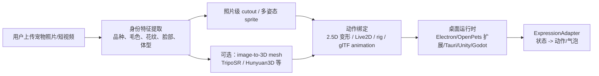

# 真实宠物桌面形象路线

## 会议约束

2026-05-30 MVP 功能设计讨论已经明确：

- 真实宠物和电子宠物共存；真实宠物分身和纯电子宠物前端视角尽量统一，主要差异是数据来源。
- 桌宠入口需要和真实宠物主体形象对应，不能只用无关的默认动物。
- 团队理想方案是“生成最心爱的宠物的真实 3D 形象”，但当前开源项目精细度不够，第一版不能阻塞在完整 3D 建模、骨骼绑定和动作库。
- 若真实 3D 不可行，会议接受卡通/Q 版作为退路；但当前 Demo 更适合走“照片级特征 + 2.5D 桌宠 sprite”的中间路线。

## 当前修正结论

当前目标不是“任意 3D”，而是**必须和真实宠物高度对齐**。维度不是第一优先级，真实性和可动性才是第一优先级。

当前可接受路线：

**用户上传照片 -> 提取宠物身份特征 -> 生成/抠出照片级宠物资产 -> 在桌面透明窗口中做 2D/2.5D 动态 -> 后续再升级高质量 3D mesh/rig。**

明确排序：

1. **高保真照片级 2D/2.5D 动态桌宠**：当前 Demo 主路线。
2. **高质量 3D mesh + rig 动态桌宠**：后续增强路线，只有在能保持真实宠物一致性时才升级。
3. **低保真程序化 3D 模型**：错误方向，不应作为展示方案。

当前桌面端补充实现：

- `ai-pet/desktop-photo-pet/`：Electron 透明/无边框/置顶桌面窗口。
- `npm run dev:photo-pet`：启动照片级动态桌宠。
- `ai-pet/public/assets/pets/mochi/mochi-corgi-realistic-v1.png`：当前照片级 Mochi cutout 占位资产。

## 本次 Demo 的复用边界

`reports/desktop-pet-avatar-demo/` 只是上一轮用于验证“真实宠物桌面形象”的视觉原型：

- **没有 fork 或复制任何开源项目代码。**
- **没有导入 OpenPets pet pack 到桌面运行时。**
- **没有使用 BongoCat、AI-Desktop-Pet、Live2D 或 Rive 的代码和模型。**
- HTML/CSS 展示原型是本项目新写的。
- Mochi 柯基 PNG 是本次新生成并去背的项目资产。

当前新增 `ai-pet/desktop-photo-pet/` 是桌面运行程序验证，不再依赖浏览器打开 HTML 页面。它内部使用 Electron 渲染透明桌面窗口，但产品形态是桌面端运行程序。

真正参考的开源项目仍是 **OpenPets**，但它的边界要重新说明。参考范围是：

- 系统级桌宠窗口作为 MVP 底座。
- `pet.json` + `spritesheet.webp` 这类 pet package 思路。
- MCP/CLI/IPC 驱动 `say/react/status` 的控制链路。
- OpenPets 能作为“表达外壳”，AI Pet 自己负责真实宠物档案、状态机、任务和 AI 解释。

如果 OpenPets 当前形象包仍以 spritesheet 为主，则可以承接照片级 2D/2.5D 动态路线；若要高质量 3D，则需要扩展 OpenPets renderer 或采用独立桌面 3D/2.5D runtime。

BongoCat 和 AI-Desktop-Pet 不是本次 Demo 的实现来源，只是说明未来如果要做 Live2D/模型导入和更细动作，可以参考它们的表达层方向。

不采用：

- 第一版直接做无法对齐真实宠物的低保真 3D 数字宠物。
- 只用 OpenPets built-in pet 作为最终展示。
- 把桌宠做成普通网页卡片或静态头像。

理由：

- 用户最新纠偏说明：不真实的 3D 是错误方向，照片级 2D 平面也可以，但必须能动。
- OpenPets 已能提供系统级桌宠窗口、pet asset、MCP/CLI/IPC 控制链路，适合作为运行底座或被扩展为表达外壳。
- 照片级 sprite 可以先保持真实宠物一致性，再用呼吸、轻微位移、气泡和状态图模拟“活着”的感觉。
- 完整 3D 或 Live2D 猫狗模型需要照片采集、建模/拆图、绑定、动作和授权流程；只有在生成质量足够贴近真实宠物时才应进入主路径。

## 可参考对象

| 方向 | 参考 | 可借鉴点 | 当前用法 |
|---|---|---|---|
| 桌宠运行时 | OpenPets | 桌面窗口、pet package、本地 IPC、MCP tools、气泡和 reaction | MVP 主底座参考；真实高保真形象可能需要扩展 renderer |
| 高级 2D 动作 | BongoCat / AI-Desktop-Pet / Live2D Cubism SDK | 静态图拆层、表情、物理、动作播放 | 后续“高级形象模式”；本次未使用 |
| 状态机驱动动画 | Rive Runtime | app 状态驱动交互动画，跨端 runtime | 后续可用于轻量矢量 UI/表情；本次未使用 |
| 照片到 3D | TripoSR / Hunyuan3D | 单图或多图生成 mesh、PBR 纹理、glTF/OBJ 导出 | 后续生成链路候选；当前先不实现 |
| 桌面存在感 | EMO、Moflin、aibo | 小动作、主动 check-in、眼神和非语言反馈 | 作为表现节奏参考，不做硬件模拟 |

## Demo 资产

本次已生成 Mochi 柯基桌宠形象：

- 源图：`reports/desktop-pet-avatar-demo/mochi-corgi-green.png`
- 透明图：`reports/desktop-pet-avatar-demo/mochi-corgi-cutout.png`
- 应用资产：`ai-pet/public/assets/pets/mochi/mochi-corgi-realistic-v1.png`
- 展示原型：`reports/desktop-pet-avatar-demo/index.html`
- 验证截图：`reports/desktop-pet-avatar-demo/desktop-avatar-demo.png`
- 桌面运行程序：`ai-pet/desktop-photo-pet/`
- 启动命令：`cd ai-pet && npm run dev:photo-pet`

当前图像满足：

- 1254×1254 PNG。
- `hasAlpha: yes`。
- 浏览器验证无 console error。
- 1280×720 视口内桌宠完整显示。

## 最小实现步骤

1. 采集真实宠物照片或用当前档案生成参考特征：品种、毛色、花纹、眼睛、耳朵、体型、特殊标记。
2. 先输出照片级 cutout/sprite，保证和真实宠物身份一致。
3. 通过 2D/2.5D 动画让它动起来：idle、sleep、alert、happy、walk 或 hop。
4. 若走 OpenPets，打包为 pet pack：`pet.json` + `spritesheet.webp` 或按 OpenPets 需要的素材格式组织。
5. 若走独立 runtime，加载 cutout、视频 sprite、Live2D/Rive/Spine 或未来 glTF。
6. `ExpressionAdapter` 把领域状态映射到桌宠状态：
   - sleep -> 睡觉姿态。
   - alert/error -> 竖耳、靠近屏幕、气泡提醒。
   - play/happy -> 轻跳、摇尾、短气泡。
   - tired/dirty/watch -> 降低饱和度、趴下或低头。
7. 点击桌宠展开应用窗口；复杂换装和健康分析仍在应用窗口完成，结果同步回桌宠形象。

## 照片上传到宠物生成链路

当前先记录链路，不要求本轮完整实现：

## 后续升级

若需要更真实：

- 短期：用多张真实照片/视频帧做一致性生成，补足不同角度和状态。
- 中期：把半写实 sprite 拆成头、耳、身体、腿、尾巴局部层，做伪骨骼动画。
- 高级：为猫狗定制 Live2D/Rive/Spine 或高质量 3D 模型，但必须先确认资产制作成本、授权、运行时体积和 OpenPets/桌面运行时集成方式。
